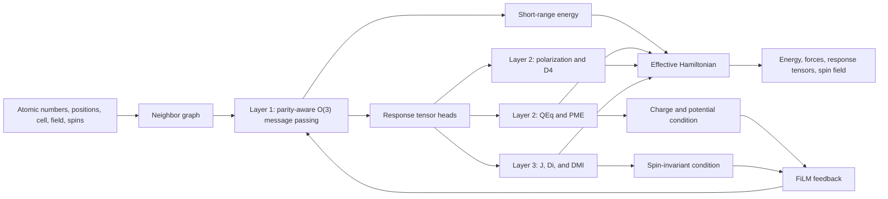
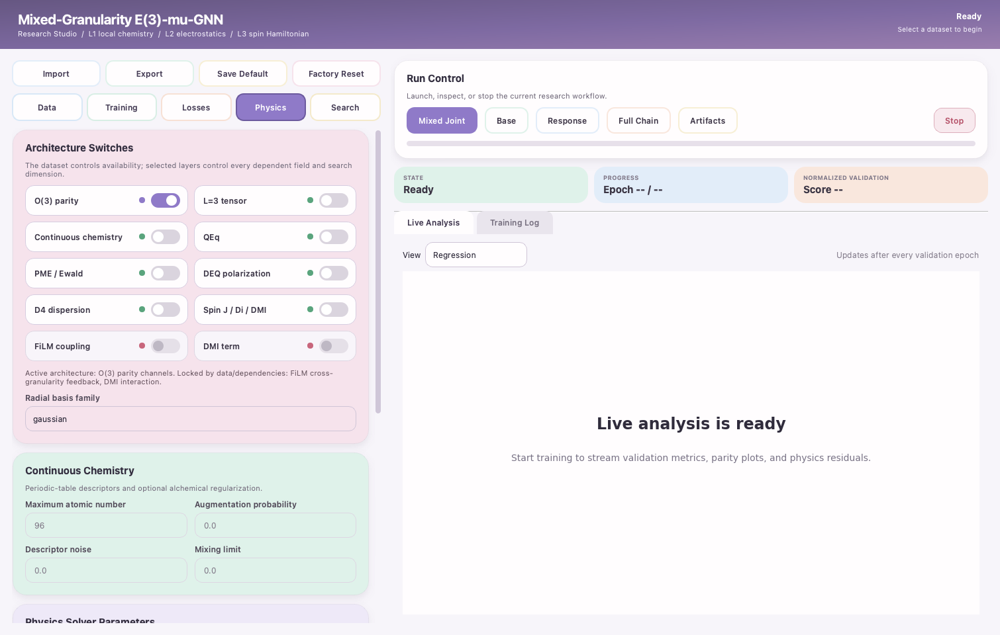

# Mixed-Granularity E(3)-mu-GNN

An E(3)-equivariant atomistic graph neural network that couples local chemical
interactions, differentiable electrostatic and polarization physics, and a
time-reversal-aware spin Hamiltonian in one trainable model.

> **Research status.** The three-layer architecture, canonical data pipeline,
> training system, PyQt6 interface, and deterministic physics tests are
> implemented. Reported dataset and short-run metrics are functional validation,
> not a claim of a converged universal interatomic potential.


*Figure 1. Implemented E(3)-mu-GNN atomic, domain-response, spin, and coupling
architecture.*

## What is implemented

- **Layer 1 - local atomic representation:** scalar, polar-vector,
  axial-vector, symmetric-traceless $`L=2`$, and optional $`L=3`$ channels with
  explicit O(3) parity handling.
- **Layer 2 - domain response:** constrained differentiable QEq, periodic
  Ewald/PME through `torch-pme`, Thole-damped self-consistent polarization,
  molecular DFT-D4, dipoles, polarizabilities, charges, C6, and Born effective
  charges.
- **Layer 3 - magnetic response:** geometry-conditioned Heisenberg exchange,
  traceless single-ion anisotropy, optional Dzyaloshinskii-Moriya interaction,
  magnetic moments, and effective spin fields.
- **Cross-granularity feedback:** charge, electrostatic potential, and spin
  invariants modulate atomic message passing through bounded FiLM gates.
- **Training and evaluation:** mask-aware mixed-label losses, group-safe fixed
  splits, staged base/response/joint training, normalized multi-task model
  selection, live plots, memory diagnostics, safe checkpoints, and a
  dataset-aware Auto Research search space.
- **Data tooling:** canonical ragged HDF5, deterministic tier construction,
  strict validation, provenance records, source-specific masking, and
  rights-aware Hugging Face staging.

## Effective Hamiltonian

The implemented model assembles

```math
E_{\mathrm{tot}} =
E_{\mathrm{short}} + E_{\mathrm{QEq}} + E_{\mathrm{PME}}
+ E_{\mathrm{D4}} + E_{\mathrm{spin}} + E_{\mathrm{resp}},
```

with electric response

```math
E_{\mathrm{resp}}
= -\boldsymbol{\mu}\cdot\boldsymbol{\mathcal E}
- \frac{1}{2}\boldsymbol{\mathcal E}^{\mathsf T}
\boldsymbol{\alpha}\boldsymbol{\mathcal E}.
```

Forces and spin fields remain derivatives of the same energy:

```math
\mathbf F_i=-\frac{\partial E_{\mathrm{tot}}}{\partial \mathbf R_i},
\qquad
\mathbf H_i^{\mathrm{eff}}=-\frac{\partial E_{\mathrm{spin}}}{\partial \mathbf S_i},
\qquad
Z^{*}_{i,\alpha\beta}=\frac{\partial \mu_\alpha}{\partial R_{i\beta}}.
```

## Execution graph



## Quick start

Python 3.10 or newer is recommended.

```bash
python -m venv .venv
source .venv/bin/activate
python -m pip install --upgrade pip
python -m pip install -r requirements.txt

pytest -q
python E3_miu_GNN.py self-test
python E3_miu_GNN.py gui
```

The GUI is the default research workflow for dataset inspection, architecture
selection, training, live plots, solver residuals, memory monitoring, and
Auto Research.



## Command-line workflows

Inspect and validate a canonical dataset:

```bash
python E3_miu_GNN.py dataset-summary path/to/data.h5
python E3_miu_GNN.py dataset-validate path/to/data.h5 --output validation.json
```

Train and evaluate:

```bash
python E3_miu_GNN.py train \
  --dataset path/to/data.h5 \
  --mode joint \
  --device auto \
  --epochs 50 \
  --out-ckpt model.pt

python E3_miu_GNN.py evaluate \
  model.pt path/to/data.h5 \
  --split test \
  --output test_metrics.json
```

Convert an extXYZ file into the canonical schema:

```bash
python E3_miu_GNN.py dataset-extxyz \
  input.extxyz.gz output.h5
```

Run `python E3_miu_GNN.py --help` for the complete dataset,
training, evaluation, VASP, self-test, and GUI command set.

### Phonon workflow

Launch the finite-displacement Phonopy interface with:

```bash
python Verify_Program_Phonon.py
```

Native mixed-granularity checkpoints default to `full_coupled`, so enabled
QEq, PME, polarization, D4, FiLM, and available spin terms contribute to the
same conservative energy used for forces. The interface also provides a
`ground_only` comparison mode, unit-cell charge scaling, external fields,
frozen ASE/VASP spin states, equilibrium-force subtraction, and CPU/MPS/CUDA
device selection. SevenNet TorchScript exports remain ground-only by design.

## Dataset access and policy

The GitHub repository includes the Tiny file for a quick start. Small,
Standard, Large, and the complete release metadata are hosted in the
[FonaTech/E3-miu-GNN Hugging Face dataset](https://huggingface.co/datasets/FonaTech/E3-miu-GNN).
Neo uses the `e3mu-hdf5-v1` schema with explicit label masks, units, provenance,
physical parent groups, and fixed train/validation/test splits. Missing labels
are never fabricated, and incompatible absolute energy references are not
silently mixed.

| Neo tier | Structures | Approximate size | Intended use | Download |
| --- | ---: | ---: | --- | --- |
| Tiny | 5,575 | 21.3 MB | Fast functional checks | [GitHub](https://github.com/FonaTech/E3-miu-GNN/blob/main/datasets/neo_tiny_l1_l2_l3.h5) |
| Small | 15,221 | 52.8 MB | Intermediate experiments | [Hugging Face](https://huggingface.co/datasets/FonaTech/E3-miu-GNN/blob/main/canonical/neo_small_l1_l2_l3.h5) |
| Standard | 46,414 | 135.1 MB | Portable mixed-granularity training | [Hugging Face](https://huggingface.co/datasets/FonaTech/E3-miu-GNN/blob/main/canonical/neo_mixed_l1_l2_l3.h5) |
| Large | 613,267 | 1.23 GB | Trajectory-rich training | [Hugging Face](https://huggingface.co/datasets/FonaTech/E3-miu-GNN/blob/main/canonical/neo_large_l1_l2_l3.h5) |

Large-scale pretraining is currently in progress. The present release provides
the architecture, training system, datasets, and validation tools; validated
pretrained checkpoints will be published in a later project version.

The software MIT license does not relicense dataset components. In particular,
the archive-level redistribution terms for the transformed `BEC/H2O`,
`BEC/MAPbI3`, and `BEC/dimer` records remain under review. Read
[Dataset and licensing](docs/DATASETS.md) before redistributing a binary.

## Verified behavior

The current source tree passes 54 regression tests and the deterministic
physics self-test. The checked invariants include:

- rotation and reflection behavior of energy, force, dipole, and
  polarizability;
- invariance of spin energy and odd transformation of the effective spin field
  under simultaneous spin reversal;
- graph-wise charge conservation and QEq stationarity;
- conservative forces against finite differences;
- differentiable QEq, PME, polarization, D4, FiLM, and Layer-3 losses;
- HDF5 mask semantics, group-safe splits, checkpoint round trips, and VASP
  magnetic mapping.


Short benchmark values, dataset limitations, and memory measurements are
reported in [Training and validation](docs/TRAINING_AND_VALIDATION.md). They
must not be interpreted as production accuracy claims.

## Paper and technical documentation

The Markdown manuscript describes the implemented E(3)-GNN system. Each paper
part maps to a deeper user or developer reference:

| Manuscript part | Technical document |
| --- | --- |
| Full paper | [Paper](docs/PAPER.md) |
| Scientific background and scope | [Scientific background](docs/SCIENTIFIC_BACKGROUND.md) |
| Three-layer network and coupling | [Architecture](docs/ARCHITECTURE.md) |
| Hamiltonians and physical mechanisms | [Physics](docs/PHYSICS.md) |
| Neo composition, schema, and rights | [Datasets](docs/DATASETS.md) |
| Optimization, validation, and measured results | [Training and validation](docs/TRAINING_AND_VALIDATION.md) |
| Installation and reproducibility | [Reproducibility](docs/REPRODUCIBILITY.md) |
| Mathematical definitions and code map | [Formula reference](docs/FORMULAE.md) |

## Repository layout

```text
E3_miu_GNN.py   Single executable implementation
tests/                        Regression and physics tests
docs/PAPER.md                 Markdown manuscript
docs/*.md                     Technical sections and reproducibility notes
docs/assets/                  Architecture figures and measured plots
Datasets/Neo/*.md             Dataset card, schema, provenance, and rights docs
requirements.txt              Runtime and test dependencies
```

## Citation

Use [CITATION.cff](CITATION.cff) when citing the software. Until a versioned
archival release or journal DOI exists, cite the repository commit used in the
experiment together with the dataset versions and checksums.

## License

Original software and project documentation are released under the
[MIT License](LICENSE). Datasets, checkpoints, dependencies, and identifiable
third-party records are not relicensed by MIT. Read [NOTICE.md](NOTICE.md) and
[Datasets/Neo/LICENSES_AND_ATTRIBUTION.md](Datasets/Neo/LICENSES_AND_ATTRIBUTION.md)
before redistribution.
