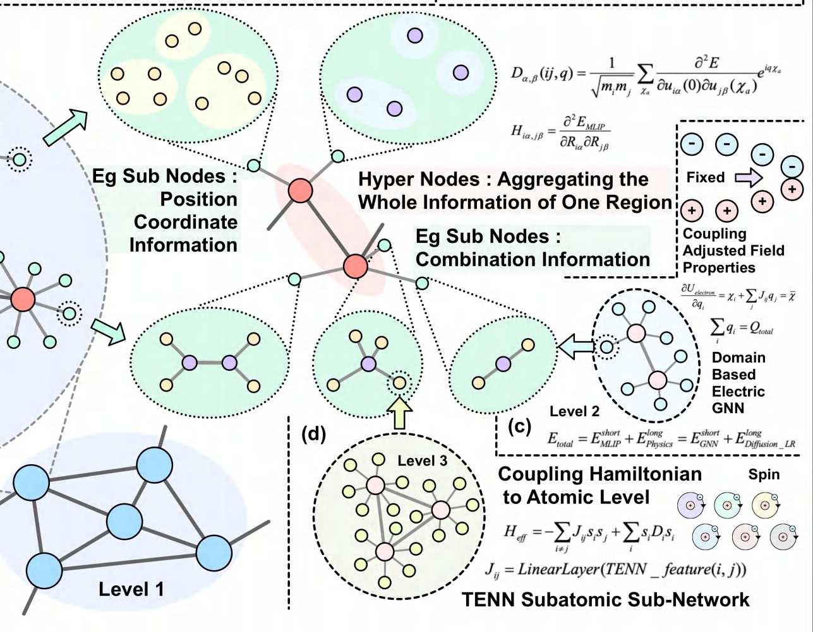
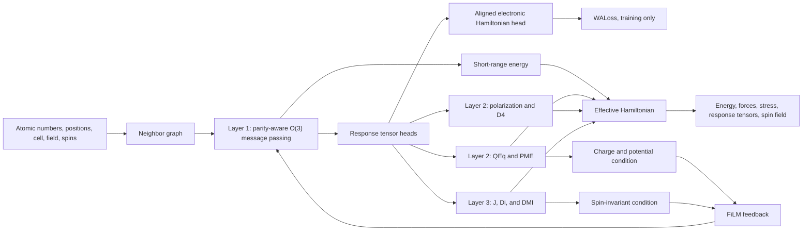

# Mixed-Granularity E(3)-mu-GNN

E3-miu-GNN is an open-source research platform for learning atomistic energy
surfaces together with electric, magnetic, and electronic response. It combines
an E(3)-equivariant local graph representation with differentiable physical
solvers, mixed-granularity feedback, and a mask-aware data/training system.
The same model can be used from the GUI, command line, ASE, or headless Python
and LLM workflows.

> **Research status.** The three-layer architecture, canonical data pipeline,
> training system, PyQt6 interface, and deterministic physics tests are
> implemented. Reported dataset and short-run metrics are functional validation,
> not a claim of a converged universal interatomic potential.



*Figure 1. E(3)-mu-GNN atomic, domain-response, spin, and coupling architecture.*

## Core capabilities

The project combines three physical layers and the tooling needed to train and
evaluate them:

- **Layer 1 — local atomic representation:** scalar, polar-vector, axial-vector,
  symmetric-traceless $`L=2`$, and configurable $`L=3`$ channels with explicit
  O(3) parity handling.
- **Layer 2 — domain response:** differentiable constrained QEq, periodic
  Ewald/PME through `torch-pme`, Thole-damped self-consistent polarization,
  molecular DFT-D4, dipoles, polarizabilities, charges, C6, and Born effective
  charges.
- **Layer 3 — magnetic response:** geometry-conditioned Heisenberg exchange,
  traceless single-ion anisotropy, Dzyaloshinskii–Moriya interaction,
  magnetic moments, and effective spin fields, with capability gating when a
  selected dataset or architecture does not activate a term.
- **Cross-granularity feedback:** bounded FiLM modulation from charge,
  electrostatic-potential, and spin invariants, with label-aware activity masks
  that keep inactive L2/L3 mechanisms out of L1-only foundation graphs.
- **Training and evaluation:** mask-aware mixed-label objectives, group-safe
  fixed splits, staged Base/Response/Joint training, normalized multi-task
  checkpoint selection, conservative cell-strain stress, BEC sum-rule and
  coupling constraints, live plots, memory diagnostics, safe checkpoints, and
  dataset-aware Auto Research with one-factor screening, physical-group
  refinement, and independent confirmation.
- **Data tooling:** canonical and Composite ragged HDF5, deterministic tier
  construction, strict validation, provenance records, source-specific masks,
  and rights-aware Hugging Face staging with Dataset Viewer tables.

An optional wavefunction-aligned Hamiltonian objective (WALoss) is available for
datasets that provide paired, gauge-aligned orbital/Wannier labels. The current
Neo release does not include those labels; its ordinary energy, force, stress,
response, and spin targets remain fully usable.

## Effective Hamiltonian

The implemented model assembles

```math
E_{\mathrm{tot}} =
E_{\mathrm{short}} + E_{\mathrm{QEq}} + E_{\mathrm{PME}}
+ E_{\mathrm{D4}} + E_{\mathrm{spin}} + E_{\mathrm{resp}},
```

with electric response

```math
E_{\mathrm{resp}}
= -\boldsymbol{\mu}_{\mathrm{permanent}}\cdot\boldsymbol{\mathcal E}
- \frac{1}{2}\boldsymbol{\mathcal E}^{\mathsf T}
\boldsymbol{\alpha}\boldsymbol{\mathcal E}.
```

Forces and spin fields remain derivatives of the same energy:

```math
\mathbf F_i=-\frac{\partial E_{\mathrm{tot}}}{\partial \mathbf R_i},
\qquad
\boldsymbol\sigma=\frac{1}{V}\mathrm{sym}
\frac{\partial E_{\mathrm{tot}}}{\partial\boldsymbol\varepsilon},
\qquad
\mathbf H_i^{\mathrm{eff}}=-\frac{\partial E_{\mathrm{spin}}}{\partial \mathbf S_i},
\qquad
Z^{*}_{i,\alpha\beta}=\frac{\partial \mu_\alpha}{\partial R_{i\beta}}.
```

## Wavefunction alignment loss

Entry-wise Hamiltonian fitting in an arbitrary raw orbital basis does not state
which errors perturb orbital energies and which errors mix reference states.
This matters because a matrix can contain many individually small errors, while
their collective spectral norm grows with subspace size; near a small energy
gap, even a modest off-diagonal perturbation can strongly rotate the associated
eigenspace. WALoss makes those two physical effects explicit.

For a reference Hamiltonian $`H_g^*`$ with orthonormal eigenvectors $`U_g^*`$
and a predicted Hamiltonian $`\widehat H_g`$, both matrices are expressed in the
reference eigenspace:

```math
\widetilde H_g=(U_g^*)^\dagger\widehat H_gU_g^*,
\qquad
\widetilde H_g^*=(U_g^*)^\dagger H_g^*U_g^*
=\mathrm{diag}(\epsilon_{g,1}^*,\ldots,\epsilon_{g,K}^*).
```

The diagonal residual directly penalizes orbital-energy error. The strict upper
triangle penalizes unwanted coupling between reference eigenstates without
counting a symmetric pair twice. The two populations are normalized
independently before applying their weights:

```math
\mathcal L_{\mathrm{WA}}
=\lambda_{\mathrm d}\mathcal L_{\mathrm{diag}}
+\lambda_{\mathrm o}\mathcal L_{\mathrm{off}}.
```

This is a physics-informed auxiliary objective: it encodes the reference
eigenproblem in the feature-space loss, but it is not a Kohn-Sham solver and it
does not reconstruct a real-space many-electron wavefunction. The prediction
path never diagonalizes $`\widehat H_g`$; gradients pass only through fixed
basis products and the symmetric Hamiltonian head. The head is graph-level,
real, and fixed $`K\times K`$, is separate from the $`J/D_i`$/DMI spin
Hamiltonian, and does not enter $`E_{\mathrm{tot}}`$.

Scientific use requires every labelled row to share the same ordered
orbital/Wannier subspace, gauge or degenerate-subspace convention, energy zero,
spin channel, k-point convention, and electronic-structure method. The current
Neo release files contain neither `orbital_hamiltonian` nor
`orbital_eigenvectors` (the absent optional dimension resolves to $`K=0`$), so
WALoss is implemented in the code but is not trained by any published Neo tier.
A compatible custom dataset can enable it in Response or Joint mode with:

```json
{
  "mode": "response",
  "model": {"enable_waloss": true, "waloss_dim": 0},
  "w_waloss": 1.0,
  "waloss_diagonal_weight": 1.0,
  "waloss_off_diagonal_weight": 1.0
}
```

`waloss_dim = 0` requests inference from the paired HDF5 labels. See the
[physics derivation](docs/PHYSICS.md#wavefunction-alignment-and-electronic-hamiltonian),
[training contract](docs/TRAINING_AND_VALIDATION.md#wavefunction-alignment-objective),
and [dataset contract](docs/DATASETS.md#optional-waloss-data-contract).

The change is backward compatible at the current loader boundary. Legacy Neo
data and pre-WALoss checkpoints continue to train and infer their original
targets; a WALoss-enabled warm start reuses the matching ground/response
weights and initializes only the new electronic head. This does not grant an
old checkpoint electronic-Hamiltonian validity, and a new WALoss checkpoint is
not promised to load in source versions that predate the head.

## Execution graph


```mermaid
flowchart LR
    A[Atomic numbers, positions, cell, field, spins] --> G[Neighbor graph]
    G --> L1["Layer 1: parity-aware O(3) message passing"]
    L1 --> PES[Short-range energy]
    L1 --> R[Response tensor heads]
    R --> W[Aligned electronic Hamiltonian head]
    W --> WA[WALoss, training only]
    R --> Q[Layer 2: QEq and PME]
    R --> P[Layer 2: polarization and D4]
    R --> S[Layer 3: J, Di, and DMI]
    Q --> C[Charge and potential condition]
    S --> C2[Spin-invariant condition]
    C --> F[FiLM feedback]
    C2 --> F
    F --> L1
    PES --> H[Effective Hamiltonian]
    Q --> H
    P --> H
    S --> H
    H --> O[Energy, forces, stress, response tensors, spin field]
```

## Quick start

Python 3.10 or newer is recommended.

```bash
python -m venv .venv
source .venv/bin/activate
python -m pip install --upgrade pip
python -m pip install -r requirements.txt

pytest -q
python E3_miu_GNN.py self-test
python E3_miu_GNN.py gui
```

The GUI is the default research workflow for dataset inspection, architecture
selection, training, live plots, solver residuals, memory monitoring, and
Auto Research.


## Command-line workflows

Inspect and validate a canonical dataset:

```bash
python Datasets_Preparation.py dataset-summary path/to/data.h5
python Datasets_Preparation.py dataset-validate path/to/data.h5 --output validation.json
```

Train and evaluate:

```bash
python E3_miu_GNN.py train \
  --dataset path/to/data.h5 \
  --mode joint \
  --device auto \
  --epochs 50 \
  --out-ckpt model.pt

python E3_miu_GNN.py evaluate \
  model.pt path/to/data.h5 \
  --split test \
  --output test_metrics.json
```

Canonical HDF5 training and evaluation stream structures and labels by
default. Exact neighbor topology is cached once in a read-only, memory-mapped
layout, CPU assembly is bounded to a two-batch prefetch window, and only the
current batch is transferred to the accelerator. SE, Plus, and Max use lossless
packed HDF5 arrays; contiguous rows are fetched as a batch and Composite caches
use the same source-, selection-, cutoff-, and backend-keyed exact topology
format. Use `--no-stream-hdf5` only for materialized debug comparisons; legacy
extXYZ input is still parsed into memory. Measured
Tiny RAM and I/O trade-offs are reported in
[Training and validation](docs/TRAINING_AND_VALIDATION.md#memory-behavior).

Convert an extXYZ file into the canonical schema:

```bash
python Datasets_Preparation.py dataset-extxyz \
  input.extxyz.gz output.h5
```

Convert an older self-contained Composite file from embedded Parquet to the
training-optimized packed layout without overwriting the source:

```bash
python Datasets_Preparation.py dataset-composite-pack-omat \
  neo_plus_l1_l2_l3.h5 \
  --output neo_plus_l1_l2_l3_packed.h5
```

Build and locally verify the Hugging Face Dataset Viewer tables without
duplicating the complete HDF5 training rows:

```bash
python Datasets_Preparation.py dataset-viewer-build \
  Datasets/Neo --verify-hf-datasets --overwrite
```

Run `python E3_miu_GNN.py --help` for training, evaluation, self-test, and GUI
commands. Run `python Datasets_Preparation.py --help` for offline dataset,
release-staging, and VASP data-generation commands. Legacy `dataset-*` and
`vasp-*` invocations through `E3_miu_GNN.py` are lazily forwarded.

### Model API and automation

The repository includes a stable headless package for human scripts, ASE,
workflow engines, and LLM agents:

```bash
python -m pip install -e .
e3mu --pretty inspect model.pt
e3mu predict model.pt POSCAR --properties energy,forces,stress --output prediction.json
```

```python
from ase.io import read
from e3mu import E3MUCalculator

atoms = read("POSCAR")
atoms.calc = E3MUCalculator("model.pt", device="auto", model_mode="auto")
energy = atoms.get_potential_energy()
forces = atoms.get_forces()
stress = atoms.get_stress()  # fully periodic cells; use a stress-trained checkpoint
```

Checkpoint inspection reports the trained inference mode, supported elements,
active physics, trusted outputs, and explicit limitations before a calculation
runs. Versioned JSON schemas and LLM function contracts are stored in
[`coupling/`](coupling/README.md). See the [API reference](docs/API.md),
[interface guide](docs/INTERFACES.md), and [coupling guide](docs/COUPLING.md).
The portable agent skill is in [`skills/e3-miu-gnn/`](skills/e3-miu-gnn/SKILL.md);
runtime-specific install locations are listed in the interface guide.

### Phonon workflow

Launch the finite-displacement Phonopy interface with:

```bash
python Verify_Program_Phonon.py
```

Native mixed-granularity checkpoints default to `full_coupled`, so enabled
QEq, PME, polarization, D4, FiLM, and available spin terms contribute to the
same conservative energy used for forces. The interface also provides a
`ground_only` comparison mode, unit-cell charge scaling, external fields,
frozen ASE/VASP spin states, equilibrium-force subtraction, and CPU/MPS/CUDA
device selection. SevenNet TorchScript exports remain ground-only by design.

## Dataset access and policy

The GitHub repository includes the Tiny file for a quick start. Small,
Standard, Large, and release metadata are hosted in the
[FonaTech/E3-miu-GNN Hugging Face dataset](https://huggingface.co/datasets/FonaTech/E3-miu-GNN).
Neo uses two self-contained HDF5 layouts. Canonical Tiny, Small, Standard, and
Large files use `e3mu-hdf5-v1` with root groups `structures/`, `labels/`,
`masks/`, and `metadata/`. Composite SE, Plus, and Max files use
`e3mu-composite-hdf5-v1`: the same four groups embed the complete Neo response
payload, while `selection/`, `sources/omat24/packed/`, and
`atomic_reference/` store a deterministic OMat24 foundation and its exact
provenance. Missing labels are never fabricated, and incompatible absolute
energy references are not silently mixed.

The Hugging Face repository also exposes bounded real-structure previews and
complete tier, label, and source summary tables. These Parquet views support
browser inspection; the self-contained HDF5 files remain authoritative for
training.

| File/tier | Schema | Embedded Neo response | OMat24 foundation | Total structures | Total atoms | On-disk size | Status / intended use |
| --- | --- | ---: | ---: | ---: | ---: | ---: | --- |
| Tiny | canonical | 5,780 | 0 | 5,780 | 394,755 | 20.011 MiB | Fast functional checks; [GitHub](https://github.com/FonaTech/E3-miu-GNN/blob/main/Datasets/Neo/canonical/neo_tiny_l1_l2_l3.h5) |
| Small | canonical | 16,703 | 0 | 16,703 | 1,069,318 | 51.218 MiB | Development experiments; [Hugging Face](https://huggingface.co/datasets/FonaTech/E3-miu-GNN/blob/main/canonical/neo_small_l1_l2_l3.h5) |
| Standard | canonical | 46,414 | 0 | 46,414 | 2,316,736 | 0.120772 GiB | Portable mixed-granularity training; [Hugging Face](https://huggingface.co/datasets/FonaTech/E3-miu-GNN/blob/main/canonical/neo_mixed_l1_l2_l3.h5) |
| SE | composite | Standard: 46,414 | 559,279 | 605,693 | 12,767,209 | 0.690297 GiB | Compact foundation; exact `1/180` Max selector |
| Large | canonical | 613,267 | 0 | 613,267 | 17,760,024 | 1.219244 GiB | Trajectory-rich response training; [Hugging Face](https://huggingface.co/datasets/FonaTech/E3-miu-GNN/blob/main/canonical/neo_large_l1_l2_l3.h5) |
| Plus | composite | Large: 613,267 | 25,206,004 | 25,819,271 | 488,227,614 | 38.237181 GiB | Quarter-scale material-family foundation |
| Max | composite | Large: 613,267 | 100,670,282 | 101,283,549 | 1,899,323,661 | 128.559024 GiB | Full deduplicated OMat24 foundation |

These are the seven supported tiers. Tiny $`\subset`$ Small $`\subset`$
Standard; Large follows a separate, trajectory-rich construction policy rather
than being a simple next nested sample.

All Composite variants preserve source float64 geometry and labels without
quantization. `selection/source_order`, `row_index`, `source_row_index`,
`split_code`, and `atom_count` map each foundation record to the packed arrays.
Copying one Composite `.h5` is sufficient for training; the original OMat24
Parquet tree is not required. Plus and Max embed complete Large, whereas SE
embeds complete Standard. Max removes 154,252 duplicate
configuration IDs before selecting its 100,670,282 OMat24 records.

Every one of these seven files omits the optional `wavefunction_dim` attribute
(interpreted as no WALoss payload) and has no `orbital_hamiltonian` or
`orbital_eigenvectors` dataset. Their existing energy, force, stress, response,
and spin labels remain fully usable, but none can activate WALoss without
separately collected and gauge-aligned electronic labels.

The 2026-07-25 Tiny-Large revision adds raw non-OMat24 stress supervision from
MPtrj and JARVIS-DFPT. Standard contains 22,873 stress records, including 112
records with matched BEC and clamped-ion piezoelectric tensors and 12,000 with
matched spin states. Large contains 505,848 stress records, including the same
112 L2 records and 72,929 spin-conditioned L3 records. No paired
target-minus-reference magnetoelastic labels have been fabricated; that loss
remains disabled until the constrained-spin DFT campaign is completed. The
current Plus and Max binaries embed this enriched Large payload. Their combined
stress counts are 25,711,852 and 101,176,130, respectively; each retains the
112 matched L2 records and 72,929 spin-conditioned L3 records from Large.

Large-scale pretraining is currently in progress. The present release provides
the architecture, training system, datasets, and validation tools; validated
pretrained checkpoints will be published in a later project version.

The software MIT license does not relicense dataset components. In particular,
the archive-level redistribution terms for the transformed `BEC/H2O`,
`BEC/MAPbI3`, and `BEC/dimer` records remain under review. Read
[Dataset and licensing](docs/DATASETS.md) before redistributing a binary.

## Verified behavior

The current source tree passes its regression suite and deterministic physics
self-test. The checked invariants include:

- rotation and reflection behavior of energy, force, dipole, and
  polarizability;
- invariance of spin energy and odd transformation of the effective spin field
  under simultaneous spin reversal;
- graph-wise charge conservation and QEq stationarity;
- conservative forces against finite differences;
- conservative stress, clamped-ion piezoelectric response, stress-component
  closure, and full-coupled magnetoelastic response against affine finite
  differences;
- differentiable QEq, PME, polarization, D4, FiLM, and Layer-3 losses;
- WALoss reference-basis invariance, separate diagonal/off-diagonal
  normalization, differentiability without a predicted eigensolver, paired
  masks, and separation from the classical-spin Hamiltonian;
- HDF5 mask semantics, group-safe splits, checkpoint round trips, and VASP
  magnetic mapping.


Short benchmark values, dataset limitations, and memory measurements are
reported in [Training and validation](docs/TRAINING_AND_VALIDATION.md). They
must not be interpreted as production accuracy claims.

## Paper and technical documentation

The Markdown manuscript describes the implemented E(3)-GNN system. Each paper
part maps to a deeper user or developer reference:

| Manuscript part | Technical document |
| --- | --- |
| Full paper | [Paper](docs/PAPER.md) |
| Scientific background and scope | [Scientific background](docs/SCIENTIFIC_BACKGROUND.md) |
| Three-layer network and coupling | [Architecture](docs/ARCHITECTURE.md) |
| Hamiltonians and physical mechanisms | [Physics](docs/PHYSICS.md) |
| Neo composition, schema, and rights | [Datasets](docs/DATASETS.md) |
| Optimization, validation, and measured results | [Training and validation](docs/TRAINING_AND_VALIDATION.md) |
| Installation and reproducibility | [Reproducibility](docs/REPRODUCIBILITY.md) |
| Mathematical definitions and code map | [Formula reference](docs/FORMULAE.md) |
| Python and ASE API | [Public API](docs/API.md) |
| Human, script, and agent interfaces | [Interface guide](docs/INTERFACES.md) |
| Phonopy, SevenNet-style, and workflow coupling | [Coupling](docs/COUPLING.md) |

## Repository layout

```text
E3_miu_GNN.py                 Single executable training implementation
e3mu/                         Public Python, ASE, and JSON API
coupling/                     Versioned schemas and integration examples
skills/e3-miu-gnn/            LLM-callable workflow skill
tests/                        Regression and physics tests
docs/PAPER.md                 Markdown manuscript
docs/*.md                     Technical and API documentation
docs/assets/                  Architecture figures and measured plots
Datasets/Neo/*.md             Dataset card, schema, provenance, and rights docs
requirements.txt              Complete research environment
pyproject.toml                Installable package and `e3mu` entry point
```

## Citation

Use [CITATION.cff](CITATION.cff) when citing the software. Until a versioned
archival release or journal DOI exists, cite the repository commit used in the
experiment together with the dataset versions and checksums.

## License

Original software and project documentation are released under the
[MIT License](LICENSE). Datasets, checkpoints, dependencies, and identifiable
third-party records are not relicensed by MIT. Read [NOTICE.md](NOTICE.md) and
[Datasets/Neo/LICENSES_AND_ATTRIBUTION.md](Datasets/Neo/LICENSES_AND_ATTRIBUTION.md)
before redistribution.
