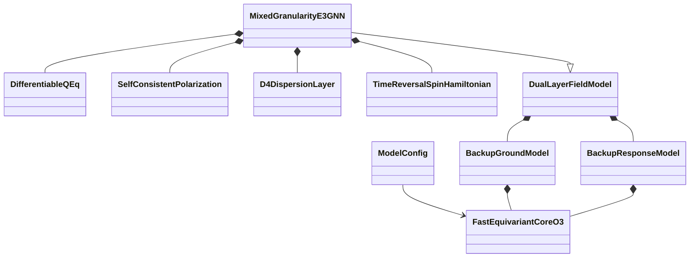
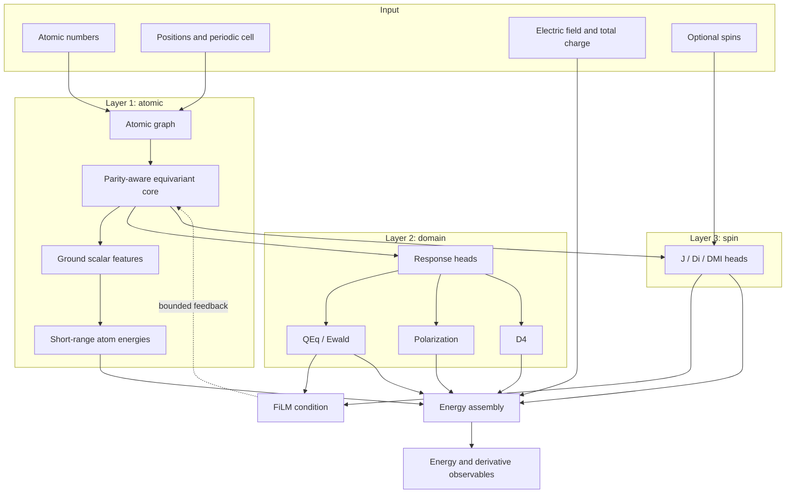
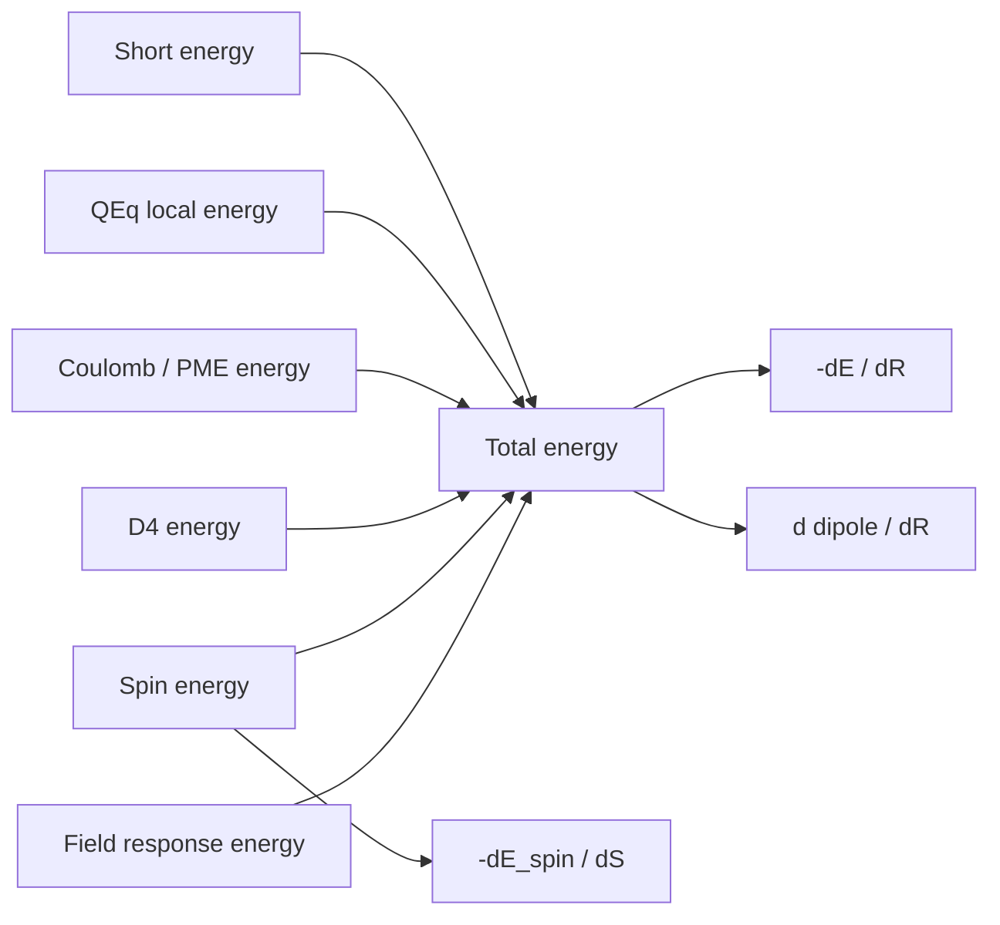
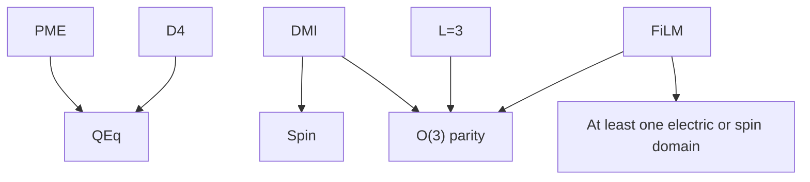

# Architecture

This document expands Sections 2 and 3 of the [paper](PAPER.md) and maps the
three-layer design to the single-file implementation in
[`E3_miu_GNN.py`](../E3_miu_GNN.py).

## Component map



| Responsibility | Implementation |
| --- | --- |
| Configuration and physics switches | `ModelConfig` |
| SO(3) fallback core | `FastEquivariantCore` |
| O(3) parity-aware core | `FastEquivariantCoreO3` |
| Field-free atomic energy | `BackupGroundModel` |
| Electric-response readouts | `BackupResponseModel` |
| Constrained charge solve | `DifferentiableQEq` |
| Induced-dipole equilibrium | `SelfConsistentPolarization` |
| Molecular dispersion | `D4DispersionLayer` |
| Magnetic Hamiltonian | `TimeReversalSpinHamiltonian` |
| Two-branch baseline | `DualLayerFieldModel` |
| Complete L1-L3 coupled model | `MixedGranularityE3GNN` |

## Data flow


The diagram shows the implemented local, domain, spin, and coupling components.

The implemented forward path is:



## Layer 1 representation

### Graph geometry

Edges use exact float64 cutoff membership during non-periodic KD-tree
construction, so the accelerated neighbor search does not change the graph.
Periodic graphs use ASE or the optional MACE neighborhood backend. An edge
vector includes its lattice image shift:

```math
\mathbf r_{ij}=\mathbf R_j+\mathbf t_{ij}-\mathbf R_i.
```

The radial envelope is

```math
f_c(r)=\frac{1}{2}\left[\cos\left(\frac{\pi r}{r_c}\right)+1\right],
\qquad 0\le r<r_c.
```

Available radial bases are fixed Gaussian, trainable Gaussian, and spherical
Bessel families.

### O(3) feature channels

| Channel | Dimension per hidden channel | Spatial character | Example source |
| --- | ---: | --- | --- |
| Scalar $s$ | 1 | $0e$ | element and invariant messages |
| Polar vector $v$ | 3 | $1o$ | displacement direction |
| Axial vector $a$ | 3 | $1e$ | cross product of polar vectors |
| ST rank-2 $T^{(2)}$ | 5 | $2e$ | traceless part of $\widehat r\otimes\widehat r$ |
| ST rank-3 $T^{(3)}$ | 7 | $3o$ | optional cubic directional basis |

The fixed $L=2$ basis is orthonormal in Cartesian tensor space. The $L=3$
basis is built deterministically by symmetrizing cubic monomials, projecting
out all traces, and applying Gram-Schmidt. A fixed basis avoids run-dependent
representation rotations.

The O(3) block has separate channels for products such as

```math
v\cdot\widehat r\rightarrow 0e,
\qquad
v\times\widehat r\rightarrow 1e,
\qquad
a\times\widehat r\rightarrow 1o.
```

Update gates receive only even invariants. This prevents a scalar gate from
changing sign under inversion and corrupting the parity contract.

### Element representation

The default categorical path uses a learned embedding over the element table
present in the dataset. Continuous chemistry replaces it with an MLP over
normalized periodic-table descriptors:

- group and period;
- Pauling electronegativity;
- atomic radius;
- first ionization energy;
- electron affinity;
- valence-electron proxy; and
- atomic mass.

Optional descriptor noise and element mixing are training-only regularizers.
They are disabled by default and never alter evaluation inputs.

### Energy head

The ground branch produces atom-wise learned corrections plus fitted atomic
references,

```math
E_{\mathrm{short}}=\sum_i
\left(E^{\mathrm{ref}}_{z_i}+f_E(s_i)\right).
```

References are fit with a weakly regularized least-squares solve so small
multi-element subsets remain finite even when the composition matrix is rank
deficient.

## Response representation

The response branch uses its own equivariant core. Its readouts are deliberately
typed:

- scalar features produce raw charge, electronegativity, hardness, isotropic
  polarizability, and C6 scale;
- polar features produce permanent atomic dipoles;
- $L=2$ features produce the anisotropic polarizability tensor; and
- axial features condition DMI in the spin layer.

The branch separation permits base-only training, frozen-ground response
training, and joint fine-tuning without conflating field-free energy with
field-induced targets.

## Mixed-granularity feedback

FiLM is enabled only with parity-aware O(3). Before the first atomic pass, the
condition is zero. Domain and spin predictions then produce

```math
c_i=\left[\tanh q_i,\tanh(\phi_i/10),\|S_i\|^2,
\langle S_i\cdot S_j\rangle_{j\in\mathcal N(i)}\right].
```

Every core interaction has a learned linear map from $c_i$ to three hidden
vectors: scalar scale, scalar bias, and tensor scale. Scales are bounded to
$\pm0.25$ through `tanh`; tensor modulation is shared across polar, axial,
$L=2$, and optional $L=3$ channels. The outer loop records mean graph-wise
charge change as `coupling_residual` and can stop before the configured maximum.

## Energy and derivative order

Energy components are evaluated before derivatives:



This order is essential. Adding a force correction after differentiation would
break conservatism; differentiating the assembled energy includes every active
physics term.

## Output contract

The complete model returns:

- `energy`, `forces`, and each named energy component;
- `charges`, molecular and atomic dipoles;
- molecular and atomic polarizability;
- `c6` and `bec`;
- pair `Jij`, atom-wise `Di`, pair `DMIij`, and graph summaries;
- magnetic moments and effective spin field; and
- QEq, polarization, stability, and FiLM coupling diagnostics.

Outputs exist even when a branch is inactive, but inactive outputs are zeros
and do not become labels unless the corresponding HDF5 mask and loss weight are
active.

## Configuration dependencies



The GUI applies these dependencies and then intersects them with dataset
capability. A parameter is editable only when both the architecture and the
selected labels make it meaningful.

## Checkpoint boundary

Native checkpoints store configuration, element table, atomic references, and
state dictionaries in a weights-only-compatible dictionary. Full pickled model
objects require an explicit unsafe legacy opt-in. The SevenNet-compatible
TorchScript exporter represents the ground-state branch; it is not a full
serialization of Layer-2 and Layer-3 solver behavior.
