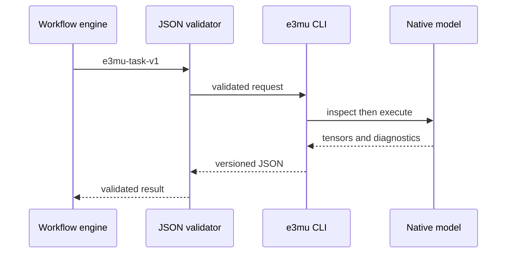

# Coupling and Integration

## ASE

ASE is the canonical in-process coupling layer. The calculator constructs the
same deterministic cutoff graph as training, validates the checkpoint element
table, and obtains forces by differentiating the selected Hamiltonian.

```python
from ase.io import read
from e3mu import E3MUCalculator

atoms = read("structure.cif")
atoms.calc = E3MUCalculator("model.pt", model_mode="auto")
energy = atoms.get_potential_energy()
forces = atoms.get_forces()
```

The runnable version is [`coupling/ase_example.py`](../coupling/ase_example.py).

## Phonopy

`Verify_Program_Phonon.py` and `e3mu.run_phonon` share `E3MUCalculator`. Finite
displacements therefore use the same ground-only/full-coupled selection,
charge, external field, frozen spin state, element validation, and MPS compile
safety as direct ASE inference.

```bash
e3mu phonon model.pt POSCAR \
  --supercell 2 2 2 \
  --dos-mesh 10 10 10 \
  --output phonon.json
```

The phonon report contains numerical band, density-of-states, mesh, and thermal
data suitable for plotting or downstream comparison.

## SevenNet-Style Interoperability

SevenNet establishes a useful integration pattern: an ASE calculator for
Python workflows and a serialized model for external runtimes. E3-miu-GNN uses
the same division while preserving its own capability boundaries.

| Surface | Native checkpoint | SevenNet-compatible export |
| --- | --- | --- |
| Energy and forces | Yes | Yes |
| QEq, PME, DEQ, D4 | When enabled and trained | No |
| Dipole, polarizability, BEC | When trained | No |
| Spin Hamiltonian | When enabled, trained, and supplied a spin state | No |
| FiLM feedback | When enabled | No |
| Virial stress | No | No; a zero placeholder is not advertised as a prediction |

Export with:

```bash
e3mu export-sevennet model.pt --output export_report.json
```

The generated `*_compat_sevennet.pt` file is a Layer-1 ground-only TorchScript
artifact. It is not claimed as a drop-in LAMMPS deployment until an external
pair style, stress implementation, and cross-platform validation are provided.

## Workflow Engines and Services

Use `e3mu-task-v1` instead of shell string construction. A service can validate
the request, run `e3mu run-task`, then validate the result.



Contract files:

- [`model_manifest.schema.json`](../coupling/model_manifest.schema.json)
- [`prediction_result.schema.json`](../coupling/prediction_result.schema.json)
- [`task_request.schema.json`](../coupling/task_request.schema.json)
- [`llm_tools.json`](../coupling/llm_tools.json)

## LLM and Agent Coupling

The repository-local skill is located at [`skills/e3-miu-gnn/`](../skills/e3-miu-gnn/SKILL.md).
It requires agents to inspect a checkpoint before computation, use task files
for deterministic execution, retain JSON outputs, and report unsupported or
untrained properties without fabrication.

The generic tool declaration in `coupling/llm_tools.json` can be adapted to a
host runtime. The actual local action should call
`skills/e3-miu-gnn/scripts/run_e3mu_task.py` or `e3mu run-task`; the language
model should not import private classes from `E3_miu_GNN.py`.

## Cross-Platform Behavior

- CPU is supported on macOS, Linux, and Windows.
- MPS is supported on Apple Silicon with float32; compile is disabled for process safety.
- CUDA is selected when available and requested.
- `device=auto` resolves CUDA, then MPS, then CPU.
- Path handling uses `pathlib`; task files contain ordinary local paths.
- Safe checkpoints are portable across devices through CPU loading followed by explicit placement.

Optional QEq/PME, D4, and phonon layers require their corresponding extras.
The manifest still remains inspectable only when all modules needed to rebuild
the stored architecture are installed.
