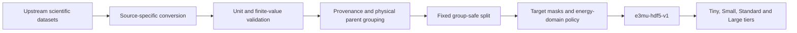
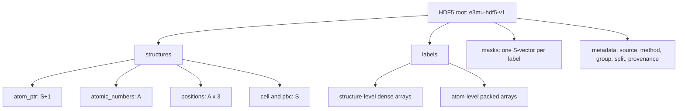
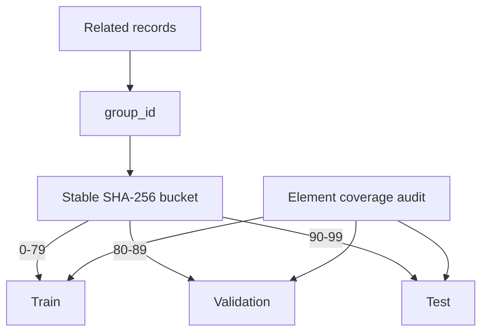

# Datasets and Canonical Data Contract

This document expands Section 4.1-4.3 of the [paper](PAPER.md). It summarizes
the data consumed by the E(3)-GNN implementation. The authoritative release
records remain the Neo [Dataset Card](../Datasets/Neo/README.md),
[source declaration](../Datasets/Neo/SOURCES_AND_PROCESSING.md),
[schema](../Datasets/Neo/DATA_SCHEMA.md), and
[license ledger](../Datasets/Neo/LICENSES_AND_ATTRIBUTION.md).

The repository carries the
[Tiny HDF5 file](https://github.com/FonaTech/E3-miu-GNN/blob/main/datasets/neo_tiny_l1_l2_l3.h5)
for quick checks. The complete dataset release, including Small, Standard, and
Large, is hosted at
[FonaTech/E3-miu-GNN on Hugging Face](https://huggingface.co/datasets/FonaTech/E3-miu-GNN).

## Design objective

No single upstream source labels every Layer-1, Layer-2, and Layer-3 target.
Neo therefore stores heterogeneous records in a mask-aware canonical HDF5
format. Missing labels remain missing; they are never converted to physical
zeros. Incompatible absolute electronic-energy references are not silently
combined.



## Upstream source families

| Source | Primary contribution | Upstream terms | Mixed-corpus treatment |
| --- | --- | --- | --- |
| MPtrj | periodic structures, energy, force, magnetic moments | MIT | compatible MP2020-corrected energy/force core |
| JARVIS-DFT | complex periodic structures and selected DFPT BEC tensors | CC BY 4.0 | response labels retained; unrelated energy domain masked |
| QM7-X | molecular energy decomposition, force, charge, dipole, polarizability, C6 | CC BY 4.0 | response labels retained; absolute energy masked in aggregate |
| SO3LR families | diverse molecular charge, dipole, polarizability, and dispersion records | CC BY 4.0 | response labels retained; absolute energy masked in aggregate |
| SCFNN | periodic water at zero and finite electric field | CC BY 4.0 | geometry-linked field/dipole variants; energy domain masked |
| DeepSPIN NiO | spin directions, magnetic moments, effective spin field | GPL-3.0 | identifiable magnetic component retained with GPL notices |
| Supplied BEC archive | H2O, MAPbI3, and dimer BEC tensors | archive rights unresolved | present locally; blocks public aggregate release |

Exact DOIs, checksums, pinned commits, transformations, and attribution text
are recorded in the source declaration and license ledger linked above.

## Canonical ragged HDF5

Let $`S`$ be the number of structures and $`A`$ the total number of packed atoms.
The schema stores geometry once and indexes variable-size structures with
`atom_ptr`.



For structure $`i`$, atom-level arrays use the half-open interval

```math
\mathcal I_i=
[\mathrm{atom\_ptr}_i,\mathrm{atom\_ptr}_{i+1}).
```

Every label $`t`$ has a structure mask $`m_{t,i}\in\{0,1\}`$. The loss may read a
target only when $`m_{t,i}=1`$:

```math
\mathcal L_t=
\frac{\sum_i m_{t,i}
\left\|\widehat{\mathbf y}_{t,i}-\mathbf y_{t,i}\right\|_2^2}
{\sum_i m_{t,i}d_t}.
```

Dense storage slots outside an active mask are padding, normally `NaN`, and
must never be interpreted as zero observations.

## Physical labels and units

| Family | Representative labels | Canonical unit |
| --- | --- | --- |
| Geometry | positions, cell | angstrom |
| Layer 1 | energy; forces | eV; eV/angstrom |
| Electric response | total charge, charges, dipole, atomic dipoles | $`e`$; $`e\,\mathrm{angstrom}`$ |
| Tensor response | polarizability, atomic polarizability; BEC | $`\mathrm{angstrom}^3`$; $`e`$ |
| Dispersion | C6 | eV $`\mathrm{angstrom}^6`$ |
| Layer 3 | spins; magnetic moments; effective field | dimensionless; $`\mu_B`$; eV/spin |
| Reserved spin targets | $`J`$, $`D_i`$, DMI | eV |

The current portable tiers contain spins, magnetic moments, and 100 effective
spin-field records. Direct aggregate $`J`$, $`D_i`$, and DMI masks are all false.
The architecture can consume those targets after compatible VASP collections
are added, but their absence must not be described as fully supervised
three-layer magnetic calibration.

## Fixed physical grouping and splits

Rows are split by physical parent rather than independently. All trajectory
frames of one material, conformers of one molecule, field variants of one
geometry, or records in one magnetic block share a `group_id` and one split.
The default stable hash allocation is approximately 80% train, 10% validation,
and 10% test.



The portable-tier builder additionally guarantees that every element in
validation or test appears in train. This is a leakage and coverage control,
not a guarantee of generalization.

## Scientifically stratified tiers

Tiny and Small are deterministic nested subsets of Standard, using seed
`20260720`:

```math
\mathrm{Tiny}\subset\mathrm{Small}\subset\mathrm{Standard}.
```

Sampling weights are proportional to the square root of source population and
are stratified by source, fixed split, label family, chemical complexity,
atom-count class, and element. Rare sources of at most 128 structures are
retained in full; group caps prevent a few trajectories from dominating the
portable tiers. Large is a trajectory-rich superset built under its own source
policy and is not simply the parent from which the three portable tiers were
sampled.


## Composite packed tiers

Plus and Max use `e3mu-composite-hdf5-v1` and are self-contained single-file
datasets. Their selected OMat24 rows are stored under
`sources/omat24/packed` with ragged `atom_ptr`, atomic numbers, positions,
forces, cells, periodic flags, stress, energies, and stable identifiers. The
packed writer preserves source float64 geometry and labels without quantization;
it does not depend on an external OMat24 directory at runtime. The complete Neo
Large payload remains embedded in the same file.

At training time, `E3_miu_GNN.py` builds or reuses an exact topology cache keyed
by the composite file, selected structure ids, cutoff, and neighborhood backend.
The cache stores edge counts for MPS edge-budget batching and bitwise-exact
periodic-shift dictionaries. This changes host decoding and graph reuse, not
the numerical labels or the model cutoff.

| Tier | Structures | Atoms | Elements | Periodic structures | File size | Distribution |
| --- | ---: | ---: | ---: | ---: | ---: | --- |
| Tiny | 5,575 | 371,803 | 85 | 3,978 | 21.3 MB | [GitHub](https://github.com/FonaTech/E3-miu-GNN/blob/main/datasets/neo_tiny_l1_l2_l3.h5) |
| Small | 15,221 | 964,550 | 85 | 9,660 | 52.8 MB | [Hugging Face](https://huggingface.co/datasets/FonaTech/E3-miu-GNN/blob/main/canonical/neo_small_l1_l2_l3.h5) |
| Standard | 46,414 | 2,316,736 | 85 | 28,284 | 135.1 MB | [Hugging Face](https://huggingface.co/datasets/FonaTech/E3-miu-GNN/blob/main/canonical/neo_mixed_l1_l2_l3.h5) |
| Large | 613,267 | 17,760,024 | 89 | 511,274 | 1.23 GB | [Hugging Face](https://huggingface.co/datasets/FonaTech/E3-miu-GNN/blob/main/canonical/neo_large_l1_l2_l3.h5) |
| Plus | 25,819,271 | 488,227,614 | 94 | 25,717,278 | 40.63 GB | [Hugging Face](https://huggingface.co/datasets/FonaTech/E3-miu-GNN/blob/main/canonical/neo_plus_l1_l2_l3.h5) |
| Max | 101,283,549 | 1,899,323,661 | 94 | 101,181,556 | 137.61 GB | [Hugging Face](https://huggingface.co/datasets/FonaTech/E3-miu-GNN/blob/main/canonical/neo_max_l1_l2_l3.h5) |

The fixed split counts are:

| Tier | Train | Validation | Test |
| --- | ---: | ---: | ---: |
| Tiny | 4,361 | 610 | 604 |
| Small | 12,094 | 1,552 | 1,575 |
| Standard | 37,192 | 4,541 | 4,681 |
| Large | 492,759 | 59,813 | 60,695 |

## Standard-tier target coverage

| Target family | Labelled structures |
| --- | ---: |
| Energy and forces | 22,761 |
| Field and total charge | 23,553 |
| Dipole | 22,891 |
| Charges and atomic dipoles | 18,130 |
| Molecular polarizability, atomic polarizability, and C6 | 4,060 |
| Born effective charge | 662 |
| Spins and magnetic moments | 12,100 |
| Effective spin field | 100 |

These counts describe available supervision, not equal coverage of every
element, chemical environment, or physical regime.

## Energy-reference policy

Absolute energies from MPtrj, QM7-X, SO3LR, SCFNN, JARVIS, BEC calculations,
and DeepSPIN were produced with different methods and reference conventions.
The aggregate shared energy/force branch therefore activates only compatible
MPtrj records. Other sources remain useful for their response or magnetic
targets while their mixed-corpus energy masks are false.

This policy avoids an ill-defined objective such as

```math
\min_\theta\sum_s
\left|E_\theta(\mathbf R_s)-E_s^{(\mathrm{method}\;s)}\right|^2
```

when the target zero and Hamiltonian change with source. A future calibrated
multi-domain energy model would require explicit offsets or source-conditioned
heads and independent validation.

## Validation commands

```bash
python Datasets_Preparation.py dataset-summary \
  Datasets/Neo/canonical/neo_tiny_l1_l2_l3.h5

python Datasets_Preparation.py dataset-validate \
  Datasets/Neo/canonical/neo_tiny_l1_l2_l3.h5

python Datasets_Preparation.py dataset-tier-audit \
  --tier tiny=Datasets/Neo/canonical/neo_tiny_l1_l2_l3.h5 \
  --tier small=Datasets/Neo/canonical/neo_small_l1_l2_l3.h5 \
  --tier standard=Datasets/Neo/canonical/neo_mixed_l1_l2_l3.h5
```

The strict validator checks schema and pointers, active-mask finiteness,
sample-ID uniqueness, group leakage, charge sums, active-spin norms, and BEC
acoustic-sum diagnostics. It reports label problems without projecting or
rewriting the source tensor.

## Redistribution boundary

The repository's MIT license does not cover Neo binaries. The binaries are
currently hosted on Hugging Face, but hosting does not replace the component
licenses or resolve the archive-level terms for transformed `BEC/H2O`,
`BEC/MAPbI3`, and `BEC/dimer` records. The associated article license is not
assumed to license a separately supplied archive.

For a fully cleared redistribution record, obtain durable permission or rebuild
every tier without those records, regenerate manifests and checksums, rerun the
hierarchy audit, and repeat model smoke tests. See the
[Hugging Face release procedure](../Datasets/Neo/HUGGINGFACE_UPLOAD.md).
