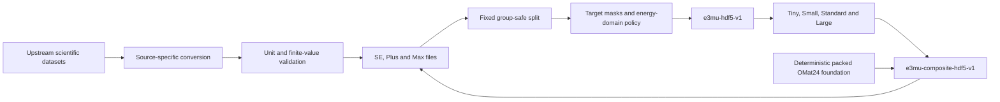
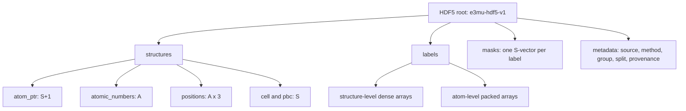
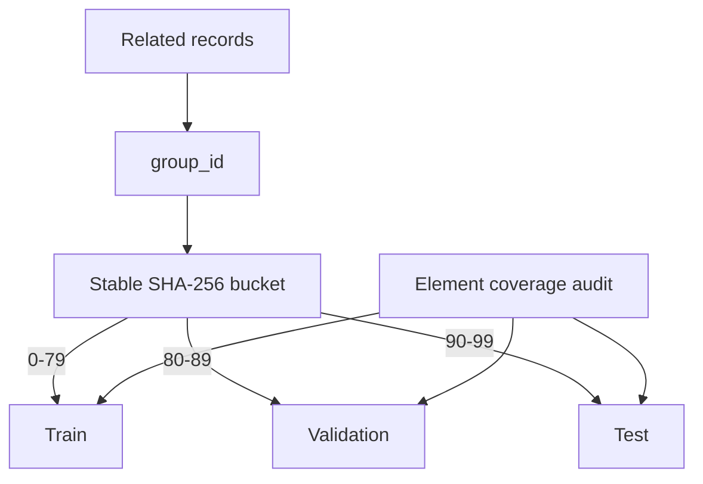
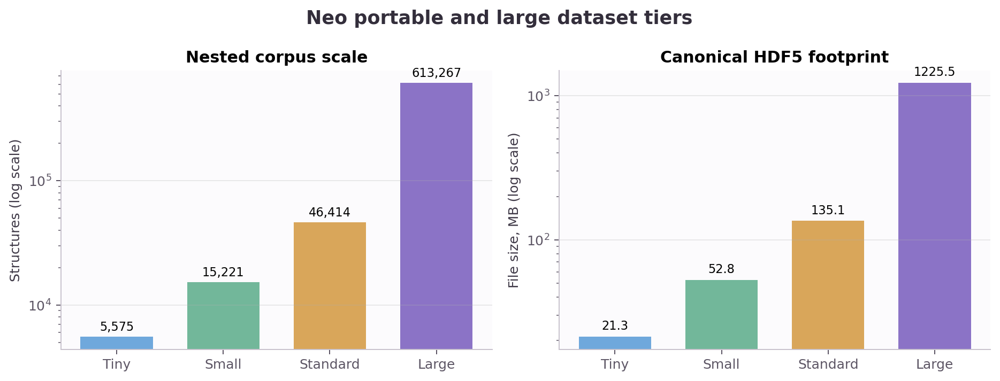

# Datasets and HDF5 Data Contracts

This document expands Sections 4.1-4.4 of the [paper](PAPER.md). It summarizes
the data consumed by the E(3)-GNN implementation. The authoritative release
records remain the Neo [Dataset Card](../Datasets/Neo/README.md),
[source declaration](../Datasets/Neo/SOURCES_AND_PROCESSING.md),
[schema](../Datasets/Neo/DATA_SCHEMA.md), and
[license ledger](../Datasets/Neo/LICENSES_AND_ATTRIBUTION.md).

The repository carries the
[Tiny HDF5 file](https://github.com/FonaTech/E3-miu-GNN/blob/main/Datasets/Neo/canonical/neo_tiny_l1_l2_l3.h5)
for quick checks. The complete release-facing dataset family, including Small,
Standard, SE, Large, Plus, and Max, is hosted at
[FonaTech/E3-miu-GNN on Hugging Face](https://huggingface.co/datasets/FonaTech/E3-miu-GNN).

## Design objective

No single upstream source labels every Layer-1, Layer-2, and Layer-3 target.
Neo therefore stores heterogeneous records in a mask-aware canonical HDF5
format. Missing labels remain missing; they are never converted to physical
zeros. Incompatible absolute electronic-energy references are not silently
combined.


```mermaid
flowchart LR
    U[Upstream scientific datasets] --> C[Source-specific conversion]
    C --> V[Unit and finite-value validation]
    V --> P[Provenance and physical parent grouping]
    P --> S[Fixed group-safe split]
    S --> M[Target masks and energy-domain policy]
    M --> H[e3mu-hdf5-v1]
    H --> T[Tiny, Small, Standard and Large]
    T --> X[e3mu-composite-hdf5-v1]
    O[Deterministic packed OMat24 foundation] --> X
    X --> P[SE, Plus and Max files]
```

## Upstream source families

| Source | Primary contribution | Upstream terms | Mixed-corpus treatment |
| --- | --- | --- | --- |
| MPtrj | periodic structures, energy, force, Cauchy stress, magnetic moments | MIT | compatible MP2020-corrected energy/force/stress core |
| JARVIS-DFT | complex periodic structures and selected stress, DFPT BEC, and clamped-ion piezoelectric tensors | CC BY 4.0 | matched response labels retained; unrelated energy domain masked |
| QM7-X | molecular energy decomposition, force, charge, dipole, polarizability, C6 | CC BY 4.0 | response labels retained; absolute energy masked in aggregate |
| SO3LR families | diverse molecular charge, dipole, polarizability, and dispersion records | CC BY 4.0 | response labels retained; absolute energy masked in aggregate |
| SCFNN | periodic water at zero and finite electric field | CC BY 4.0 | geometry-linked field/dipole variants; energy domain masked |
| DeepSPIN NiO | spin directions, magnetic moments, effective spin field | GPL-3.0 | identifiable magnetic component retained with GPL notices |
| Supplied BEC archive | H2O, MAPbI3, and dimer BEC tensors | archive rights unresolved | present locally; blocks public aggregate release |

Exact DOIs, checksums, pinned commits, transformations, and attribution text
are recorded in the source declaration and license ledger linked above.

## Canonical ragged HDF5

Let $`S`$ be the number of structures and $`A`$ the total number of packed atoms.
The schema stores geometry once and indexes variable-size structures with
`atom_ptr`.


```mermaid
flowchart TB
    R[HDF5 root: e3mu-hdf5-v1]
    R --> G[structures]
    G --> AP[atom_ptr: S+1]
    G --> Z[atomic_numbers: A]
    G --> X[positions: A x 3]
    G --> C[cell and pbc: S]
    R --> L[labels]
    L --> LS[structure-level dense arrays]
    L --> LA[atom-level packed arrays]
    R --> M[masks: one S-vector per label]
    R --> MD[metadata: source, method, group, split, provenance]
```

For structure $`i`$, atom-level arrays use the half-open interval

```math
\mathcal I_i=
[\mathrm{atom\_ptr}_i,\mathrm{atom\_ptr}_{i+1}).
```

Every label $`t`$ has a structure mask $`m_{t,i}\in\{0,1\}`$. The loss may read a
target only when $`m_{t,i}=1`$:

```math
\mathcal L_t=
\frac{\sum_i m_{t,i}
\left\|\widehat{\mathbf y}_{t,i}-\mathbf y_{t,i}\right\|_2^2}
{\sum_i m_{t,i}d_t}.
```

Dense storage slots outside an active mask are padding, normally `NaN`, and
must never be interpreted as zero observations.

## Physical labels and units

| Family | Representative labels | Canonical unit |
| --- | --- | --- |
| Geometry | positions, cell | angstrom |
| Layer 1 | energy; forces; tensile-positive Cauchy stress | eV; eV/angstrom; eV/angstrom$^3$ |
| Electric response | total charge, charges, dipole, atomic dipoles | $`e`$; $`e\,\mathrm{angstrom}`$ |
| Tensor response | polarizability, atomic polarizability; BEC; clamped-ion piezoelectric | $`\mathrm{angstrom}^3`$; $`e`$; C/m$^2$ |
| Dispersion | C6 | eV $`\mathrm{angstrom}^6`$ |
| Layer 3 | spins; magnetic moments; effective field | dimensionless; $`\mu_B`$; eV/spin |
| Reserved spin targets | $`J`$, $`D_i`$, DMI; paired magnetoelastic stress | eV; eV/angstrom$^3$ |
| Optional electronic WALoss | orbital Hamiltonian; reference eigenvectors | eV; dimensionless |

The current portable tiers contain spins, magnetic moments, and 100 effective
spin-field records. Direct aggregate $`J`$, $`D_i`$, and DMI masks are all false.
The architecture can consume those targets after compatible VASP collections
are added, but their absence must not be described as fully supervised
three-layer magnetic calibration.

## Optional WALoss data contract

WALoss is an optional extension of the canonical response-label contract used
by `e3mu-hdf5-v1` and by the response root of
`e3mu-composite-hdf5-v1`; it does not imply that a Neo release tier contains
electronic-structure matrices. A labeled structure owns both of the following
structure-level arrays or neither:

| Label | Per-structure shape | Unit | Meaning |
| --- | --- | --- | --- |
| `orbital_hamiltonian` | `(K, K)` | eV | Real-symmetric electronic Hamiltonian in the declared aligned orbital/Wannier basis |
| `orbital_eigenvectors` | `(K, K)` | dimensionless | Reference eigenvectors as columns in the same basis |

One file has one fixed positive $`K`$, recorded as the root attribute
`wavefunction_dim`. Both masks must be active together. The reader verifies
finite values, matching square shapes, real symmetry, orthonormal columns, and
that the supplied eigenvectors diagonalize the paired Hamiltonian. Inactive
dense slots are padding and never become zero-valued supervision.

Shape agreement is not sufficient scientific alignment. Every row must use the
same ordered orbital or Wannier subspace, phase/gauge convention, spin channel,
k-point convention, energy zero, and electronic-structure method, or must be
explicitly separated into compatible training domains. For near-degenerate
states, align the whole degenerate subspace before choosing individual vectors.
The current contract represents one fixed matrix per structure; it is not a
general variable-band or k-resolved Hamiltonian container.

The current Neo Tiny, Small, Standard, SE, Large, Plus, and Max files do not
publish these two labels and omit the optional `wavefunction_dim` attribute, so
WALoss remains disabled for those binaries. Adding the optional schema fields
does not rewrite or claim new supervision for any existing release.

## Fixed physical grouping and splits

Rows are split by physical parent rather than independently. All trajectory
frames of one material, conformers of one molecule, field variants of one
geometry, or records in one magnetic block share a `group_id` and one split.
The default stable hash allocation is approximately 80% train, 10% validation,
and 10% test.


```mermaid
flowchart TD
    A[Related records] --> G[group_id]
    G --> H[Stable SHA-256 bucket]
    H -->|0-79| T[Train]
    H -->|80-89| V[Validation]
    H -->|90-99| E[Test]
    C[Element coverage audit] --> T
    C --> V
    C --> E
```

The portable-tier builder additionally guarantees that every element in
validation or test appears in train. This is a leakage and coverage control,
not a guarantee of generalization.

## Scientifically stratified tiers

Tiny and Small are deterministic nested subsets of Standard, using seed
`20260720`:

```math
\mathrm{Tiny}\subset\mathrm{Small}\subset\mathrm{Standard}.
```

Sampling weights are proportional to the square root of source population and
are stratified by source, fixed split, label family, chemical complexity,
atom-count class, and element. Rare sources of at most 128 structures are
retained in full; group caps prevent a few trajectories from dominating the
portable tiers. Large is a trajectory-rich superset built under its own source
policy and is not simply the parent from which the three portable tiers were
sampled.



### Canonical file inventory

All four canonical files expose the same four root groups and differ only in
row selection and source policy. Their current materialized contents are:

| Tier | File | Structures | Atoms | Elements | Periodic structures | On-disk size | Relationship |
| --- | --- | ---: | ---: | ---: | ---: | ---: | --- |
| Tiny | `neo_tiny_l1_l2_l3.h5` | 5,780 | 394,755 | 85 | 3,769 | 20.011 MiB | Deterministic nested subset of Small |
| Small | `neo_small_l1_l2_l3.h5` | 16,703 | 1,069,318 | 85 | 11,859 | 51.218 MiB | Deterministic nested subset of Standard |
| Standard | `neo_mixed_l1_l2_l3.h5` | 46,414 | 2,316,736 | 85 | 28,284 | 0.120772 GiB | Complete portable response corpus |
| Large | `neo_large_l1_l2_l3.h5` | 613,267 | 17,760,024 | 87 | 511,274 | 1.219244 GiB | Separate trajectory-rich policy |

The canonical fixed splits are:

| Tier | Train | Validation | Test |
| --- | ---: | ---: | ---: |
| Tiny | 4,539 | 627 | 614 |
| Small | 13,319 | 1,698 | 1,686 |
| Standard | 37,192 | 4,541 | 4,681 |
| Large | 492,759 | 59,813 | 60,695 |

## Composite packed tiers

SE, Plus, and Max use `e3mu-composite-hdf5-v1`. Each is a self-contained single
HDF5 file with this logical structure:

```text
/
|-- structures/                   embedded complete Standard or Large geometry
|-- labels/                       embedded Neo response labels
|-- masks/                        embedded per-label validity masks
|-- metadata/                     embedded Neo provenance and fixed splits
|-- selection/
|   |-- source_order              OMat24 shard index
|   |-- row_index                 selected materialized row
|   |-- source_row_index          exact upstream Parquet row
|   |-- split_code                0=train, 1=validation, 2=test
|   `-- atom_count                exact structure size for batch planning
|-- sources/omat24/packed/
|   |-- atom_ptr, atomic_numbers, positions, cell, pbc
|   |-- energy, forces, stress, stress_volume_normalized
|   `-- configuration_id, material_id, source_row_index
`-- atomic_reference/             OMat24-only normal equations and element map
```

The canonical root groups describe the response component only; the OMat24
foundation is not duplicated into those arrays. A composite reader forms its
logical dataset from both components and uses `selection/split_code` for the
foundation rows. The packed writer preserves source float64 geometry and labels
without quantization, and runtime loading does not depend on an external OMat24
directory.

| File/tier | Embedded Neo response | OMat24 foundation | Total structures | Total atoms | On-disk size | Role |
| --- | ---: | ---: | ---: | ---: | ---: | --- |
| SE | Standard: 46,414 | 559,279 | 605,693 | 12,767,209 | 0.690297 GiB | Compact foundation; exact `1/180` Max selection |
| Plus | Large: 613,267 | 25,206,004 | 25,819,271 | 488,227,614 | 38.237181 GiB | Quarter-scale material-family foundation |
| Max | Large: 613,267 | 100,670,282 | 101,283,549 | 1,899,323,661 | 128.559024 GiB | Complete deduplicated OMat24 foundation |

Plus and Max embed complete Large; SE embeds complete Standard. Max removes
154,252 duplicated configuration IDs before the retained 100,670,282-row
selection.

At training time, `E3_miu_GNN.py` builds or reuses an exact topology cache keyed
by the composite file, selected structure ids, cutoff, and neighborhood backend.
The cache stores edge counts for MPS edge-budget batching and bitwise-exact
periodic-shift dictionaries. This changes host decoding and graph reuse, not
the numerical labels or the model cutoff.

## Target coverage across response tiers

The mask-derived active structure counts for all canonical response payloads
are shown below. Composite files inherit one complete Standard or Large column
and add OMat24 energy/force/stress foundation rows; they do not copy response
labels onto the OMat24 component.

| Target family | Tiny | Small | Standard | Large |
| --- | ---: | ---: | ---: | ---: |
| Energy and forces | 1,912 | 8,131 | 22,761 | 505,736 |
| Cauchy stress | 2,024 | 8,243 | 22,873 | 505,848 |
| Field and total charge | 3,768 | 8,472 | 23,553 | 107,431 |
| Dipole | 3,145 | 7,810 | 22,891 | 106,769 |
| Charges and atomic dipoles | 2,011 | 4,844 | 18,130 | 101,993 |
| Molecular/atomic polarizability and C6 | 302 | 406 | 4,060 | 43,430 |
| Born effective charge | 623 | 662 | 662 | 662 |
| Clamped-ion piezoelectric tensor | 112 | 112 | 112 | 112 |
| Spins and magnetic moments | 1,074 | 4,320 | 12,100 | 73,029 |
| Effective spin field | 100 | 100 | 100 | 100 |
| Stress + spins | 974 | 4,220 | 12,000 | 72,929 |
| Paired magnetoelastic stress | 0 | 0 | 0 | 0 |
| Paired WALoss matrices | 0 | 0 | 0 | 0 |

SE therefore contains the Standard response counts plus 559,279 OMat24
foundation rows; its total stress count is 582,152. Plus and Max
contain the Large response counts plus their respective foundations; their
total stress counts are 25,711,852 and 101,176,130. All 112 JARVIS-DFPT rows
jointly carry stress, BEC, and piezoelectric labels. The stress-plus-spin rows
are mechanism-matched total-stress observations, not same-geometry spin-pair
differences, so `magnetoelastic_stress` remains inactive. Likewise, zero WALoss
coverage means absence of the optional paired matrices, not a zero-valued
electronic Hamiltonian.

These counts describe available supervision, not equal coverage of every
element, chemical environment, or physical regime.

## Energy-reference policy

Absolute energies from MPtrj, QM7-X, SO3LR, SCFNN, JARVIS, BEC calculations,
and DeepSPIN were produced with different methods and reference conventions.
The aggregate shared energy/force branch therefore activates only compatible
MPtrj records. Other sources remain useful for their response or magnetic
targets while their mixed-corpus energy masks are false.

This policy avoids an ill-defined objective such as

```math
\min_\theta\sum_s
\left|E_\theta(\mathbf R_s)-E_s^{(\mathrm{method}\;s)}\right|^2
```

when the target zero and Hamiltonian change with source. A future calibrated
multi-domain energy model would require explicit offsets or source-conditioned
heads and independent validation.

## Validation commands

```bash
python Datasets_Preparation.py dataset-summary \
  Datasets/Neo/canonical/neo_tiny_l1_l2_l3.h5

python Datasets_Preparation.py dataset-validate \
  Datasets/Neo/canonical/neo_tiny_l1_l2_l3.h5

python Datasets_Preparation.py dataset-tier-audit \
  --tier tiny=Datasets/Neo/canonical/neo_tiny_l1_l2_l3.h5 \
  --tier small=Datasets/Neo/canonical/neo_small_l1_l2_l3.h5 \
  --tier standard=Datasets/Neo/canonical/neo_mixed_l1_l2_l3.h5
```

The strict validator checks schema and pointers, active-mask finiteness,
sample-ID uniqueness, response-family leakage, charge sums, active-spin norms,
BEC acoustic-sum diagnostics, stress periodicity/symmetry/convention metadata,
and piezoelectric strain-axis symmetry. It reports label problems without
projecting or rewriting the source tensor.

## Redistribution boundary

The repository's MIT license does not cover Neo binaries. The binaries are
currently hosted on Hugging Face, but hosting does not replace the component
licenses or resolve the archive-level terms for transformed `BEC/H2O`,
`BEC/MAPbI3`, and `BEC/dimer` records. The associated article license is not
assumed to license a separately supplied archive.

For a fully cleared redistribution record, obtain durable permission or rebuild
every tier without those records, regenerate manifests and checksums, rerun the
hierarchy audit, and repeat model smoke tests. See the
[Hugging Face release procedure](../Datasets/Neo/HUGGINGFACE_UPLOAD.md).
