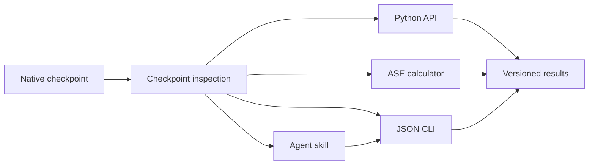

# Interface Guide

E3-miu-GNN exposes one checkpoint implementation through four interfaces. Each
interface uses the same model-mode selection, element validation, units, and
numerical checks.



## Human Interface

The PyQt6 research GUI remains the interactive training interface. For model
use, the `e3mu` command is more reproducible:

```bash
e3mu --pretty inspect model.pt

e3mu predict model.pt POSCAR \
  --device auto \
  --model-mode auto \
  --properties energy,forces \
  --output prediction.json

e3mu relax model.pt POSCAR \
  --fmax 0.05 \
  --steps 200 \
  --output-structure relaxed.extxyz \
  --output relaxation.json
```

Running `python -m e3mu` is equivalent when the console entry point has not
been installed.

## Script Interface

Machine consumers should use compact stdout JSON or `--output`. Runtime errors
are written to stderr as `e3mu-error-v1` and return exit status 1. Successful
commands return exit status 0.

```bash
python -m e3mu inspect model.pt > manifest.json
python -m e3mu predict model.pt POSCAR --properties energy,forces > prediction.json
```

The following commands are stable:

| Command | Purpose | Main schema |
| --- | --- | --- |
| `inspect` | Discover checkpoint architecture and trusted capabilities | `e3mu-model-manifest-v1` |
| `predict` | Predict one or more ASE-readable structures | `e3mu-prediction-v1` |
| `relax` | Fixed-cell position optimization | `e3mu-relaxation-v1` |
| `evaluate` | Evaluate a canonical dataset split | evaluator report |
| `phonon` | Run finite-displacement phonons | phonon report |
| `export-sevennet` | Export Layer-1 TorchScript | `e3mu-sevennet-export-v1` |
| `run-task` | Execute a declarative task file | action-dependent |

## Declarative Task Interface

Use a task file when a workflow engine or LLM should not assemble shell flags:

```json
{
  "schema": "e3mu-task-v1",
  "action": "predict",
  "checkpoint": "model.pt",
  "structure": "POSCAR",
  "options": {
    "device": "auto",
    "model_mode": "auto",
    "properties": ["energy", "forces"]
  }
}
```

Execute it with:

```bash
e3mu run-task request.json --output result.json
```

The request schema is
[`coupling/task_request.schema.json`](../coupling/task_request.schema.json).

## Checkpoint Modes

`model_mode=auto` uses checkpoint metadata in this order:

1. explicit `recommended_inference_mode`;
2. `training_mode=base`, `response`, or `joint`;
3. legacy base-checkpoint filename;
4. recorded response loss weights;
5. complete-model behavior when no stage evidence exists.

The result always records the selected mode and reason. `ground_only` evaluates
the short-range Layer-1 potential. `full_coupled` permits the response and
physics terms enabled by the model configuration.

## Structure Contract

Inputs use ASE conventions:

- atomic numbers are positive element numbers present in the checkpoint table;
- positions and cell vectors are in Angstrom;
- periodic structures require a finite, non-singular cell;
- `total_charge` is in elementary-charge units;
- `electric_field` is in V/Angstrom;
- spin vectors may be stored in `atoms.arrays["e3mu_spins"]`,
  `atoms.arrays["spins"]`, or ASE initial magnetic moments.

Spin vectors are normalized per active atom. Zero magnetic moments remain
non-magnetic sites. `spin_policy=required` fails if the structure or checkpoint
cannot provide the requested spin Hamiltonian.

## Capability Rules

- Inspect first and use only the manifest's `recommended` outputs for scientific conclusions.
- Do not request stress or cell relaxation; native virial stress is unavailable.
- Do not treat initialized but unsupervised heads in a base checkpoint as predictions.
- Do not use `allow_unsafe_legacy` for downloaded or untrusted files.
- Do not describe the SevenNet export as a full mixed-granularity checkpoint.
- Reject element mismatches instead of remapping unknown species.
