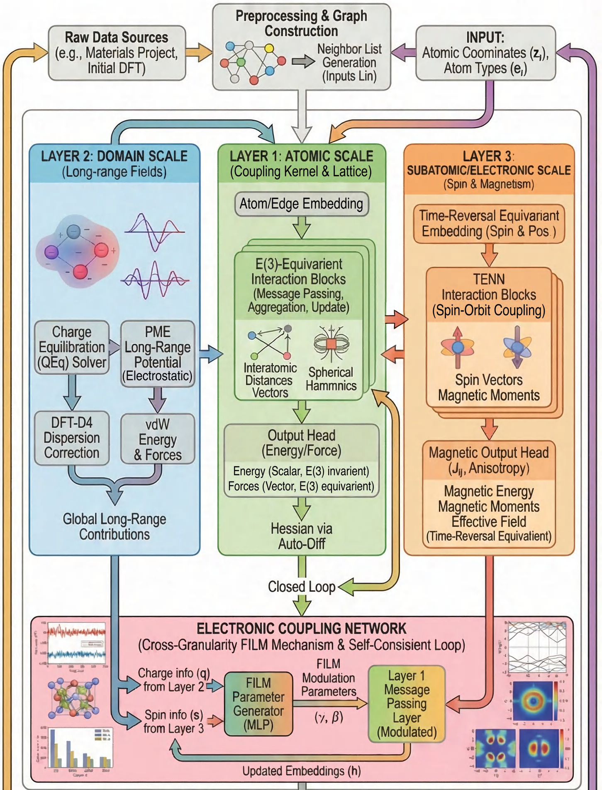
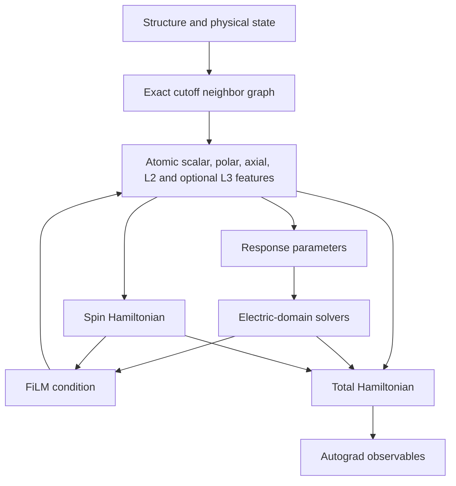
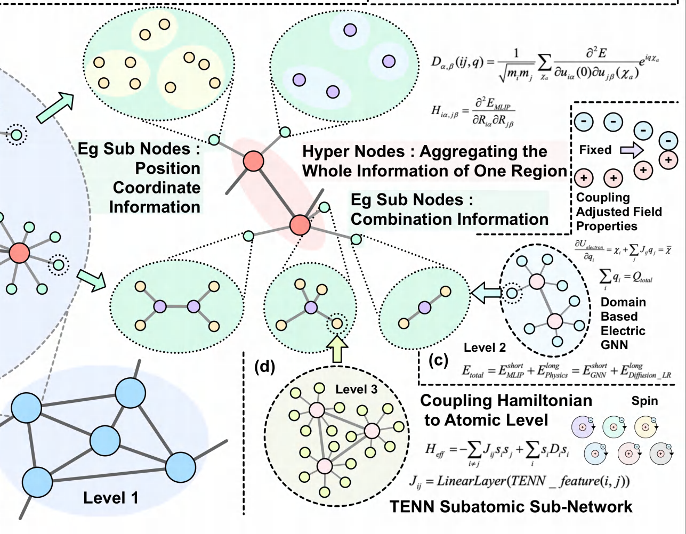
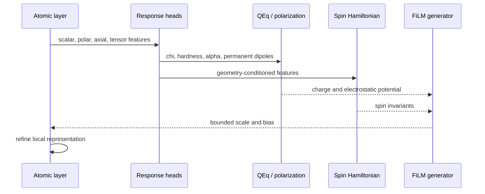
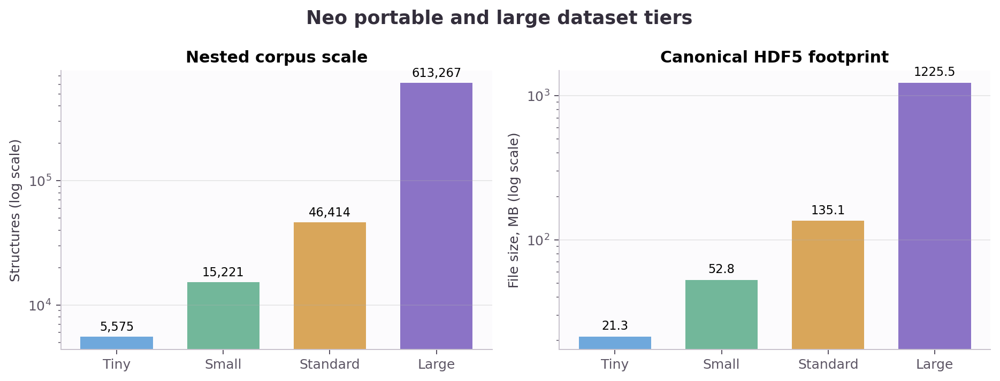
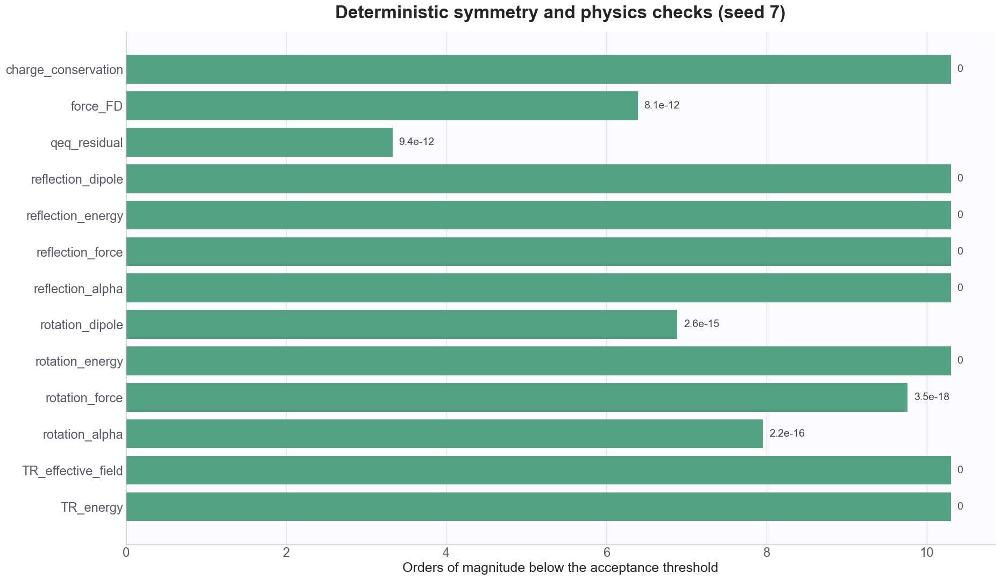
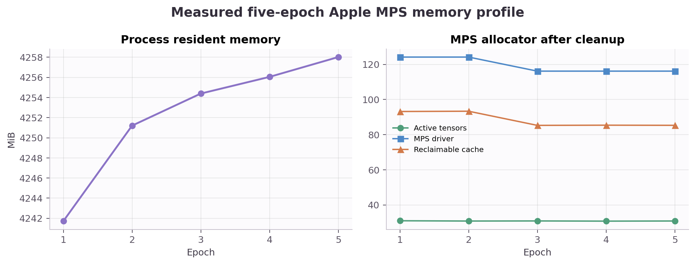

# Mixed-Granularity-Aware E(3)-Equivariant Graph Neural Network for Coupled Atomic, Electrostatic, and Spin Information

**Yufeng Zhan (Fona)**  
Implementation-aligned manuscript, July 2026

> This manuscript follows the completed E(3)-GNN chapters of the research
> proposal. It describes only functionality present in
> `Dual_Layer_Atomic_E3_GNN.py`: the atomic, domain, and spin layers, their FiLM
> coupling, the canonical dataset system, and verified training behavior.

## Abstract

Machine-learning interatomic potentials usually compress an atomistic system
into a local geometric representation and learn a scalar potential energy.
This construction is efficient, but local geometry alone is not an adequate
state description for systems in which charge redistribution, long-range
electrostatics, induced polarization, dispersion, or spin order changes the
energy landscape. We present an implementation of a mixed-granularity
E(3)-equivariant graph neural network, E(3)-mu-GNN, that separates these
mechanisms into three coupled levels. Layer 1 is a parity-aware O(3) atomic
network with scalar, polar, axial, and symmetric-traceless tensor channels.
Layer 2 predicts electronic response parameters and drives differentiable
charge equilibration, Ewald/PME electrostatics, Thole-damped polarization, and
molecular DFT-D4. Layer 3 parameterizes a time-reversal-even spin Hamiltonian
containing Heisenberg exchange, single-ion anisotropy, and an optional
Dzyaloshinskii-Moriya term. Charge, electrostatic potential, and spin
invariants feed back into Layer 1 through bounded feature-wise linear
modulation. All energy components are assembled before differentiating forces,
Born effective charges, and effective spin fields, preserving their relation to
a common Hamiltonian. A mask-aware HDF5 format permits partially labelled,
multi-source supervision without inventing absent targets or mixing
incompatible energy references. Deterministic tests verify E(3)/O(3)
transformation behavior, time reversal, charge conservation, differentiability,
and conservative forces. Short data benchmarks establish functional behavior,
while also showing that converged multi-domain and magnetic accuracy remains a
separate scientific validation problem.

## 1. Scientific background for the research

### 1.1 From electronic structure to an atomistic potential

The many-electron problem is reduced in Kohn-Sham density-functional theory
(DFT) to auxiliary one-electron equations [2,3]:

$$
\left[-\frac{\hbar^2}{2m_e}\nabla^2 + V_{\mathrm{eff}}(\mathbf r)\right]
\phi_i(\mathbf r)=\epsilon_i\phi_i(\mathbf r),
\qquad
n(\mathbf r)=\sum_i\left|\phi_i(\mathbf r)\right|^2,
\tag{1}
$$

where

$$
V_{\mathrm{eff}}(\mathbf r)
=V_{\mathrm n}(\mathbf r)+V_{\mathrm H}(\mathbf r)
+V_{\mathrm{xc}}(\mathbf r),
\qquad
V_{\mathrm{xc}}(\mathbf r)
=\frac{\delta E_{\mathrm{xc}}[n]}{\delta n(\mathbf r)}.
\tag{2}
$$

The exchange-correlation approximation controls a major part of the accuracy
and cost trade-off. One expression of its limitation is the difference between
the Kohn-Sham and quasiparticle gap,

$$
E_g^{\mathrm{QP}}=I-A=E_g^{\mathrm{KS}}+\Delta_{\mathrm{xc}}.
\tag{3}
$$

Strongly localized states are often treated with an additional on-site
correction,

$$
E_{\mathrm{DFT}+U}
=E_{\mathrm{DFT}}
+\frac{U_{\mathrm{eff}}}{2}\sum_\sigma
\operatorname{Tr}\!\left[\mathbf n_\sigma
\left(\mathbf I-\mathbf n_\sigma\right)\right],
\qquad U_{\mathrm{eff}}=U-J.
\tag{4}
$$

Equations (1)-(4) motivate the proposal but are not embedded as an explicit
DFT or DFT+$U$ solver in E(3)-mu-GNN. The implemented model instead learns an
effective atomistic Hamiltonian from labelled calculations while enforcing
geometric and physical structure in its representation and solver layers.

### 1.2 Why a local scalar model is insufficient

An ML interatomic potential approximates the Born-Oppenheimer potential energy
surface $E(\mathbf R)$ and evaluates forces by differentiation. A strictly
local decomposition,

$$
E_{\mathrm{local}}(\mathbf R)=\sum_i \varepsilon_i
\left(\mathcal N_i^{r_c}\right),
\tag{5}
$$

is effective when interactions outside the cutoff $r_c$ are screened or can be
absorbed into local environments. It becomes incomplete when the state depends
on a global charge constraint, reciprocal-space electrostatics, collective
polarization, or spin order. Treating all such effects as an unconstrained
correction to one scalar network also obscures which symmetry and conservation
law each quantity must satisfy.

The central research question is therefore:

> Can local atomic geometry, domain-scale electric response, and subatomic spin
> information be represented at their natural physical granularities while
> remaining differentiable parts of one energy model?

## 2. Purpose, scientific significance, and originality

The objective is a unified atomistic model with three explicit representation
levels:

1. a local E(3)/O(3)-equivariant atomic potential;
2. an electric domain layer with constrained and long-range solvers; and
3. a time-reversal-aware spin Hamiltonian.

The implementation makes four concrete contributions.

**Symmetry-resolved local features.** Polar and axial vectors are kept
separate under inversion, and higher-order geometry is represented through
fixed real symmetric-traceless bases. This is required to distinguish a
displacement from a magnetic axial vector.

**Physical solvers inside autograd.** QEq, PME, induced polarization, and D4
are energy-producing sublayers rather than post-processing corrections.
Forces therefore include their positional derivatives.

**Interpretable spin energy.** Exchange, anisotropy, and DMI parameters are
predicted from geometric features and assembled into a Hamiltonian that is
exactly even under simultaneous spin reversal.

**Feedback instead of independent addition.** Layer-2 and Layer-3 invariants
condition subsequent atomic messages through FiLM. Electronic state can thus
alter the learned short-range representation before the final energy is
formed.

*Figure 1. Implemented portion of the proposal system diagram. The image is
cropped at the E(3)-GNN boundary and contains only the three physical layers and
their electronic coupling network.*

## 3. Research method and implemented architecture

### 3.1 Inputs, graph, and transformation contract

For each structure $g$, the model receives atomic numbers $z_i$, Cartesian
positions $\mathbf R_i$, cell $\mathbf A_g$, periodic flags, total charge
$Q_g$, external field $\boldsymbol{\mathcal E}_g$, and optional unit spin
vectors $\mathbf S_i$. Directed edges connect neighbors inside a cutoff,

$$
\mathbf r_{ij}=\mathbf R_j+\mathbf t_{ij}-\mathbf R_i,
\qquad
r_{ij}=\|\mathbf r_{ij}\|,
\qquad
\widehat{\mathbf r}_{ij}=\frac{\mathbf r_{ij}}{r_{ij}},
\tag{6}
$$

where $\mathbf t_{ij}$ is the periodic image shift. Translation invariance
follows from relative positions. The learned energy is invariant under O(3),
while vector and tensor outputs transform in their corresponding
representations.

*Figure 2. Atomic, domain, and spin portions of the original proposal figure.
The image is cropped before publication to exclude unimplemented agent,
reinforcement-learning, and LoRA stages.*

### 3.2 Layer 1: parity-aware atomic E(3)-GNN

The proposal writes equivariant message passing as a tensor-product expansion,

$$
\mathbf m_{ij}^{L_{\mathrm{out}}}
=\sum_{L_{\mathrm{in}},L_{\mathrm{edge}}}
W_{L_{\mathrm{in}},L_{\mathrm{edge}}\rightarrow L_{\mathrm{out}}}
(r_{ij})
\left[
\mathbf h_j^{L_{\mathrm{in}}}\otimes
\mathbf Y^{L_{\mathrm{edge}}}(\widehat{\mathbf r}_{ij})
\right]_{L_{\mathrm{out}}}.
\tag{7}
$$

The implementation realizes the selected products directly in a real
Cartesian basis. Node state contains

$$
\mathbf h_i=\left(
\mathbf s_i,\mathbf v_i,\mathbf a_i,\mathbf T_i^{(2)},
\mathbf T_i^{(3)}
\right),
\tag{8}
$$

with scalar $\mathbf s_i$, polar vector $\mathbf v_i$, axial vector
$\mathbf a_i$, five-component symmetric-traceless $L=2$ tensor
$\mathbf T_i^{(2)}$, and optional seven-component symmetric-traceless $L=3$
tensor $\mathbf T_i^{(3)}$. Examples of explicit parity-preserving channels
are

$$
\mathbf v_j\cdot\widehat{\mathbf r}_{ij}\rightarrow 0e,
\quad
\mathbf v_j\times\widehat{\mathbf r}_{ij}\rightarrow 1e,
\quad
\mathbf a_j\times\widehat{\mathbf r}_{ij}\rightarrow 1o,
\quad
\operatorname{ST}\!\left(
\mathbf v_j\otimes\widehat{\mathbf r}_{ij}
\right)\rightarrow 2e.
\tag{9}
$$

Radial filters use fixed Gaussian, trainable Gaussian, or Bessel bases and a
cosine cutoff. Aggregation is a mean over incoming edges; update gates depend
only on parity-even invariants such as $\|\mathbf v\|^2$,
$\|\mathbf a\|^2$, and tensor norms.

The short-range energy is

$$
E_{\mathrm{short}}
=\sum_i\left[E_{z_i}^{\mathrm{ref}}
+f_E(\mathbf s_i)\right].
\tag{10}
$$

The reference atomic energies are obtained from a regularized least-squares
fit over the active training set. The Hessian and dynamical matrix remain
derivatives of the same scalar surface,

$$
H_{i\alpha,j\beta}
=\frac{\partial^2 E_{\mathrm{tot}}}
{\partial R_{i\alpha}\partial R_{j\beta}},
\qquad
D_{\alpha\beta}^{ab}(\mathbf q)
=\frac{1}{\sqrt{m_a m_b}}
\sum_{\mathbf T}H_{0a\alpha,\mathbf T b\beta}
e^{i\mathbf q\cdot\mathbf T}.
\tag{11}
$$

Equation (11) states the automatic-differentiation interface. The current
validation suite tests first-derivative force consistency; it does not report a
converged phonon benchmark.

### 3.3 Field-response parameterization

Under the Born-Oppenheimer approximation, a static electric field is treated as
a perturbation $\widehat V_{\mathrm{ext}}=-\widehat{\boldsymbol\mu}\cdot
\boldsymbol{\mathcal E}$. Retaining second order gives

$$
E(\mathbf R,\boldsymbol{\mathcal E})
=E_{\mathrm{PES}}(\mathbf R)
-\boldsymbol\mu(\mathbf R)\cdot\boldsymbol{\mathcal E}
-\frac{1}{2}\boldsymbol{\mathcal E}^{\mathsf T}
\boldsymbol\alpha(\mathbf R)\boldsymbol{\mathcal E}
+\mathcal O(\|\boldsymbol{\mathcal E}\|^3).
\tag{12}
$$

The response network reads scalar, polar, and $L=2$ features. It predicts raw
charges, permanent atomic dipoles, electronegativities, positive hardnesses,
C6 scaling, and atomic polarizabilities. The latter are decomposed into an
isotropic and symmetric-traceless part,

$$
\boldsymbol\alpha_i
=\operatorname{softplus}(a_i)\mathbf I
+\sum_{k=1}^{5}c_{ik}\mathbf B_k^{(2)},
\qquad
\boldsymbol\alpha=\sum_i\boldsymbol\alpha_i.
\tag{13}
$$

The total dipole combines permanent, charge-displacement, and induced terms,

$$
\boldsymbol\mu
=\sum_i\boldsymbol\mu_i^{\mathrm{perm}}
+\sum_i q_i(\mathbf R_i-\mathbf R_c)
+\sum_i\mathbf p_i^{\mathrm{ind}}.
\tag{14}
$$

For non-periodic structures $\mathbf R_c$ is the geometric center. Periodic
relative positions use the minimum-image finite-cell convention recorded in
the data metadata.

### 3.4 Layer 2: charge and long-range domain physics

The total energy separates local and domain contributions,

$$
E_{\mathrm{tot}}=E_{\mathrm{short}}+E_{\mathrm{domain}}+E_{\mathrm{spin}}.
\tag{15}
$$

#### Differentiable charge equilibration

For one graph, QEq minimizes

$$
E_{\mathrm{QEq}}(\mathbf q)
=\boldsymbol\chi^{\mathsf T}\mathbf q
+\frac{1}{2}\mathbf q^{\mathsf T}
\left[\operatorname{diag}(\boldsymbol\eta)+\mathbf K\right]\mathbf q
+\boldsymbol\phi_{\mathrm{ext}}^{\mathsf T}\mathbf q,
\qquad
\mathbf 1^{\mathsf T}\mathbf q=Q.
\tag{16}
$$

The direct non-periodic kernel is softened at short range,

$$
K_{ij}=\frac{k_e}{\sqrt{r_{ij}^2+\sigma^2}},\qquad i\ne j.
\tag{17}
$$

Periodic graphs obtain $\mathbf K$ from an Ewald calculator. The reciprocal
contribution has the familiar form

$$
E_{\mathrm{rec}}
=\frac{1}{2\Omega}\sum_{\mathbf k\ne 0}
\frac{4\pi k_e}{\|\mathbf k\|^2}
e^{-\|\mathbf k\|^2/(4\alpha_E^2)}
\left|S(\mathbf k)\right|^2.
\tag{18}
$$

Rather than solve an indefinite KKT system, the implementation eliminates the
constraint. Let $\mathbf B$ be an analytic Helmert basis satisfying
$\mathbf 1^{\mathsf T}\mathbf B=0$ and
$\mathbf B^{\mathsf T}\mathbf B=\mathbf I$. With
$\mathbf q=\mathbf q_0+\mathbf B\mathbf z$ and
$\mathbf 1^{\mathsf T}\mathbf q_0=Q$,

$$
\left(\mathbf B^{\mathsf T}\mathbf H\mathbf B\right)\mathbf z
=-\mathbf B^{\mathsf T}\left(\mathbf H\mathbf q_0+\mathbf b\right),
\qquad
\mathbf H=\operatorname{diag}(\boldsymbol\eta)+\mathbf K.
\tag{19}
$$

A differentiable stability shift makes the reduced Hessian positive definite;
Cholesky and triangular solves then work on CPU, CUDA, and Apple MPS. The model
reports stationarity, charge, and stability residuals.

#### Self-consistent induced polarization

The induced-dipole interaction uses Thole damping [9]. Define

$$
u_{ij}=\frac{r_{ij}}{(\alpha_i\alpha_j)^{1/6}},
\quad
f_3=1-e^{-a u_{ij}^3},
\quad
f_5=1-(1+a u_{ij}^3)e^{-a u_{ij}^3},
\tag{20}
$$

and

$$
\mathbf T_{ij}
=\frac{k_e}{r_{ij}^3}
\left(3f_5\widehat{\mathbf r}_{ij}
\widehat{\mathbf r}_{ij}^{\mathsf T}-f_3\mathbf I\right).
\tag{21}
$$

The fixed point $\mathbf p=\mathbf A(\mathbf E_{\mathrm{drv}}+\mathbf T\mathbf p)$
is linear. The implementation solves its symmetric transformed system exactly,

$$
\left(\mathbf I-\mathbf A^{1/2}\mathbf T\mathbf A^{1/2}\right)\mathbf x
=\mathbf A^{1/2}\mathbf E_{\mathrm{drv}},
\qquad
\mathbf p=\mathbf A^{1/2}\mathbf x,
\tag{22}
$$

with a reported positive-definiteness shift. This is the implemented
deep-equilibrium response: it avoids retaining a long unrolled iteration graph
while preserving the equilibrium derivative.

#### Molecular DFT-D4

For non-periodic structures, the D4 sublayer delegates the charge-dependent
dispersion energy and atomic C6 coefficients to `tad-dftd4` [10]. Its
two-body damping form is schematically

$$
E_{\mathrm{D4}}^{(2)}
=-\frac{1}{2}\sum_{A\ne B}\sum_{n\in\{6,8\}}
s_n\frac{C_n^{AB}}
{R_{AB}^{n}+\left(a_1R_0^{AB}+a_2\right)^n}.
\tag{23}
$$

The current backend is molecular. Periodic structures receive no D4 energy,
and the GUI disables the switch for a dataset containing periodic structures.

### 3.5 Layer 3: time-reversal-aware spin Hamiltonian

A spin is an axial vector: under an orthogonal spatial transform $\mathbf Q$,

$$
\mathbf S_i\mapsto \det(\mathbf Q)\mathbf Q\mathbf S_i,
\tag{24}
$$

while time reversal maps $\mathbf S_i\mapsto-\mathbf S_i$. The implemented
spin energy is

$$
E_{\mathrm{spin}}
=-\sum_{i<j}J_{ij}\mathbf S_i\cdot\mathbf S_j
+\sum_i\mathbf S_i^{\mathsf T}\mathbf D_i\mathbf S_i
+\sum_{i<j}\mathbf D_{ij}^{\mathrm{DMI}}\cdot
\left(\mathbf S_i\times\mathbf S_j\right).
\tag{25}
$$

$J_{ij}$ is a scalar pair readout. $\mathbf D_i$ is symmetric and explicitly
made traceless. $\mathbf D_{ij}^{\mathrm{DMI}}$ is an axial vector assembled
from axial features and cross products of polar channels. Every term in
Equation (25) is even under simultaneous spin reversal. The predicted magnetic
moment is

$$
\mathbf m_i=\operatorname{softplus}(f_m(\mathbf s_i))\mathbf S_i,
\tag{26}
$$

and the effective field is the energy derivative

$$
\mathbf H_i^{\mathrm{eff}}
=-\frac{\partial E_{\mathrm{spin}}}{\partial\mathbf S_i}.
\tag{27}
$$

### 3.6 Cross-granularity FiLM coupling

The first domain/spin pass produces a four-component condition at every atom,

$$
\mathbf c_i=\left[
\tanh(q_i),
\tanh(\phi_i/10),
\|\mathbf S_i\|^2,
\underset{j\in\mathcal N(i)}{\operatorname{mean}}
(\mathbf S_i\cdot\mathbf S_j)
\right].
\tag{28}
$$

Each atomic interaction block maps $\mathbf c_i$ to scalar scale, scalar bias,
and tensor scale. The actual bounded modulation is

$$
\mathbf s_i\leftarrow
\left[1+0.25\tanh\boldsymbol\gamma_i^{(s)}\right]\odot\mathbf s_i
+\boldsymbol\beta_i^{(s)},
\tag{29}
$$

$$
\mathbf X_i^{(L)}\leftarrow
\left[1+0.25\tanh\boldsymbol\gamma_i^{(L)}\right]
\odot\mathbf X_i^{(L)},
\quad
\mathbf X^{(L)}\in
\{\mathbf v,\mathbf a,\mathbf T^{(2)},\mathbf T^{(3)}\}.
\tag{30}
$$

The coupled forward pass recomputes atomic, response, QEq, and spin quantities
for a bounded number of outer iterations. It stops early when the graph-wise
mean charge change is below the coupling tolerance.

### 3.7 Energy assembly and derivative observables

The complete implemented Hamiltonian is

$$
E_{\mathrm{tot}}
=E_{\mathrm{short}}+E_{\mathrm{QEq}}+E_{\mathrm{PME}}
+E_{\mathrm{D4}}+E_{\mathrm{spin}}+E_{\mathrm{resp}}.
\tag{31}
$$

The dipole-field term is not double-counted: when QEq is active, the charge
coupling to the field is already contained in the QEq linear potential.
Observables are differentiated after Equation (31):

$$
\mathbf F_i=-\frac{\partial E_{\mathrm{tot}}}{\partial\mathbf R_i},
\qquad
Z^{*}_{i,\alpha\beta}
=\frac{\partial\mu_\alpha}{\partial R_{i\beta}},
\qquad
\mathbf H_i^{\mathrm{eff}}
=-\frac{\partial E_{\mathrm{spin}}}{\partial\mathbf S_i}.
\tag{32}
$$

## 4. Data generation and training strategy

### 4.1 Canonical mixed-label representation

Neo uses a ragged HDF5 schema. Atomic arrays are concatenated and indexed by
`atom_ptr`; every physical target has a structure-level mask. The mask, not a
placeholder value, determines whether a target contributes to training.

The standard tier contains 46,414 structures and 2,316,736 atoms. Its fixed
split is 37,192 train, 4,541 validation, and 4,681 test structures. Principal
active-label counts are:

| Target | Labelled structures |
| --- | ---: |
| Energy and forces | 22,761 |
| Dipole | 22,891 |
| Charges and atomic dipoles | 18,130 |
| Molecular polarizability, atomic polarizability, and C6 | 4,060 |
| Born effective charge | 662 |
| Spins and magnetic moments | 12,100 |
| Effective spin field | 100 |

Direct $J$, $D_i$, and DMI aggregate labels are absent from the portable tiers;
their masks remain false. This is not interpreted as a zero physical value.

### 4.2 Source and energy-domain policy

Neo aggregates MPtrj, JARVIS-DFT, QM7-X, SO3LR families, SCFNN, DeepSPIN NiO,
and locally supplied BEC calculations. These sources do not share one absolute
electronic-structure reference. The mixed corpus therefore activates the
shared energy/force loss only for compatible MPtrj records and retains other
sources for response- or spin-specific labels. Related trajectory frames,
conformers, field variants, or magnetic blocks share one group and cannot cross
split boundaries.

### 4.3 Mask-aware objective

For target $t$, mask $m_{t,k}$, prediction $\widehat{\mathbf y}_{t,k}$, and
reference $\mathbf y_{t,k}$, the training objective is

$$
\mathcal L
=\sum_{t\in\mathcal T}w_t
\frac{\sum_k m_{t,k}
\left\|\widehat{\mathbf y}_{t,k}-\mathbf y_{t,k}\right\|_2^2}
{\sum_k m_{t,k}\,d_t},
\tag{33}
$$

where $d_t$ is the number of components per labelled item. The implemented
target set includes energy, forces, dipole, molecular and atomic
polarizability, charges, atomic dipoles, C6, BEC, magnetic moments, effective
spin fields, and available $J/D_i$/DMI targets. Energy loss is evaluated per
atom so large cells do not dominate solely by size.

Checkpoint selection and Auto Research use a weight-independent normalized
score,

$$
S_{\mathrm{val}}
=\frac{1}{|\mathcal T_{\mathrm{active}}|}
\sum_{t\in\mathcal T_{\mathrm{active}}}
\frac{\operatorname{MAE}_t}{s_t},
\tag{34}
$$

with fixed characteristic scales $s_t$. A candidate cannot improve its ranking
merely by reducing its own loss weight.

### 4.4 Optimization modes

The trainer supports a ground-state base stage, a response stage, and joint
fine-tuning. The full-chain workflow can freeze the ground branch during
response warmup, assign separate branch learning rates, ramp response weights,
and progressively reduce the joint learning rate. On Apple MPS, batches are
packed by edge count because force and BEC supervision require higher-order
autograd graphs whose memory cost follows edges more closely than structure
count.

Auto Research locks the user-selected architecture. Dataset masks and
periodicity remove meaningless loss and solver dimensions before search. A
random exploration phase is followed by a lightweight Gaussian-process
surrogate; the winning searched values are applied to the GUI only after an
explicit user action.

## 5. Validation and results

### 5.1 Deterministic physical tests

The float64 self-test compares transformed predictions and finite-difference
derivatives. With the documented seed 7, the current maximum errors are:

| Check | Maximum error |
| --- | ---: |
| Rotation: energy | 0 |
| Rotation: force | $3.47\times10^{-18}$ |
| Rotation: dipole | $2.61\times10^{-15}$ |
| Rotation: polarizability | $2.22\times10^{-16}$ |
| Reflection: energy/force/dipole/polarizability | 0 |
| Time reversal: spin energy/effective field | 0 |
| Charge conservation | 0 e |
| QEq stationarity residual | $9.39\times10^{-12}$ |
| Conservative-force finite difference | $8.15\times10^{-12}$ eV/A |

The repository regression suite currently contains 44 passing tests. It also
checks MPS-specific QEq solves, differentiable PME and D4 references, DEQ
gradients, Layer-3 supervised gradients, checkpoint safety, HDF5 invariants,
dataset-aware GUI state, and magnetic VASP mapping.

### 5.2 Small held-out benchmarks

These experiments are deliberately short functional baselines.

| Dataset and split | Training scope | Held-out result |
| --- | --- | --- |
| QM7-X, 8 test molecules | 12 epochs; energy, dipole, polarizability, charge, atomic polarizability | energy 1.907 eV/system; dipole 0.1313 eA/component; polarizability 0.7217 A3/component; charge 0.0949 e/atom; atomic polarizability 0.3089 A3/component |
| BEC, 4 validation cells / 768 atoms | 2 epochs | BEC MAE 0.2156 e/component |
| SCFNN, 4 validation cells / 768 atoms | 20 epochs | dipole MAE 2.435 eA/component versus zero baseline 2.972 eA/component |

The QM7-X force and C6 heads had zero loss weight and are not reported as
trained accuracy. The QEq model required a mean test stability shift of
14.39 eV in that short run, indicating that its learned raw hardness was not
yet physically calibrated.

### 5.3 Memory behavior

A five-epoch Apple MPS run with energy, force, dipole, and polarizability
losses increased process RSS by 16.3 MiB from epoch 1 to epoch 5. Active MPS
tensors remained near 30.8 MiB after cleanup, and no sustained-growth warning
was triggered.

## 6. Discussion and limitations

The tests establish structural validity: the selected representation channels
transform correctly, charges obey the graph constraint, spin energy respects
time reversal, and force/BEC/spin derivatives remain connected to the model
energy. They do not establish uniform predictive accuracy over all 94 supported
elements or every source domain.

Several boundaries are material when interpreting results:

- The current D4 backend is molecular and is not a periodic dispersion model.
- Direct $J$, $D_i$, and DMI labels are not present in the portable Neo tiers;
  the Layer-3 Hamiltonian is functionally and symmetry validated but does not
  yet have a paper-grade cross-material calibration result.
- Absolute energies from different electronic-structure methods remain
  separately masked instead of being forced into a common zero.
- Born effective charge tensors are retained as published; the dataset reports
  acoustic-sum residuals but does not silently project labels.
- Hessians are available through automatic differentiation of the energy, but
  this work does not present a converged phonon-spectrum benchmark.
- Current accuracy tables are small smoke benchmarks and must not be described
  as production potential performance.

## 7. Conclusion

E(3)-mu-GNN implements the completed core proposal as an energy-based,
mixed-granularity atomistic model. Its atomic layer provides explicit O(3)
parity channels; its domain layer turns predicted electronic parameters into
constrained electrostatic, polarization, and dispersion energies; its spin
layer supplies a time-reversal-consistent magnetic Hamiltonian; and FiLM
allows domain and spin state to refine local messages. A mask-aware dataset
contract and derivative-based validation keep the physical meaning of each
target visible. The implementation is therefore a complete research platform
for controlled L1-L3 experiments, while its short benchmarks and unresolved
data redistribution item set clear limits on current accuracy and release
claims.

## Code, data, and licensing statement

The implementation is in `Dual_Layer_Atomic_E3_GNN.py` and is released under
MIT terms. Neo dataset binaries are not covered by the software license.
MPtrj, JARVIS-DFT, QM7-X, SO3LR, SCFNN, and DeepSPIN retain their respective
upstream terms. Public redistribution of the current aggregate remains blocked
until the standalone rights of the supplied BEC archive are confirmed or its
records are removed. Exact source declarations and transformations are in
`Datasets/Neo/SOURCES_AND_PROCESSING.md`.

## References

1. Y. Zhan, *Mixed-Granularity-Aware Graph Neural Network Framework for Physical Information Prediction*, research proposal, version 5.1 (2026).
2. P. Hohenberg and W. Kohn, "Inhomogeneous Electron Gas," *Physical Review* **136**, B864-B871 (1964), <https://doi.org/10.1103/PhysRev.136.B864>.
3. W. Kohn and L. J. Sham, "Self-Consistent Equations Including Exchange and Correlation Effects," *Physical Review* **140**, A1133-A1138 (1965), <https://doi.org/10.1103/PhysRev.140.A1133>.
4. I. Batatia et al., "MACE: Higher Order Equivariant Message Passing Neural Networks for Fast and Accurate Force Fields," *NeurIPS* (2022), <https://doi.org/10.48550/arXiv.2206.07697>.
5. S. Batzner et al., "E(3)-equivariant graph neural networks for data-efficient and accurate interatomic potentials," *Nature Communications* **13**, 2453 (2022), <https://doi.org/10.1038/s41467-022-29939-5>.
6. A. K. Rappe and W. A. Goddard III, "Charge equilibration for molecular dynamics simulations," *The Journal of Physical Chemistry* **95**, 3358-3363 (1991), <https://doi.org/10.1021/j100161a070>.
7. T. Darden, D. York, and L. Pedersen, "Particle mesh Ewald: An N log(N) method for Ewald sums in large systems," *The Journal of Chemical Physics* **98**, 10089 (1993), <https://doi.org/10.1063/1.464397>.
8. U. Essmann et al., "A smooth particle mesh Ewald method," *The Journal of Chemical Physics* **103**, 8577 (1995), <https://doi.org/10.1063/1.470117>.
9. B. T. Thole, "Molecular polarizabilities calculated with a modified dipole interaction," *Chemical Physics* **59**, 341-350 (1981), <https://doi.org/10.1016/0301-0104(81)85176-2>.
10. E. Caldeweyher et al., "A generally applicable atomic-charge dependent London dispersion correction," *The Journal of Chemical Physics* **150**, 154122 (2019), <https://doi.org/10.1063/1.5090222>.
11. E. Perez et al., "FiLM: Visual Reasoning with a General Conditioning Layer," *AAAI* (2018), <https://doi.org/10.48550/arXiv.1709.07871>.
12. B. Deng et al., "CHGNet as a pretrained universal neural network potential for charge-informed atomistic modelling," *Nature Machine Intelligence* **5**, 1031-1041 (2023), <https://doi.org/10.1038/s42256-023-00716-3>.
13. J. Hoja et al., "QM7-X, a comprehensive dataset of quantum-mechanical properties spanning the chemical space of small organic molecules," *Scientific Data* **8**, 43 (2021), <https://doi.org/10.1038/s41597-021-00812-2>.
14. A. Gao and R. C. Remsing, "Self-consistent determination of long-range electrostatics in neural network potentials," *Nature Communications* **13**, 1572 (2022), <https://doi.org/10.1038/s41467-022-29243-2>.
15. T. Yang et al., "Screening Spin Lattice Interaction Using Deep Learning Approach," arXiv (2023), <https://doi.org/10.48550/arXiv.2304.09606>.
