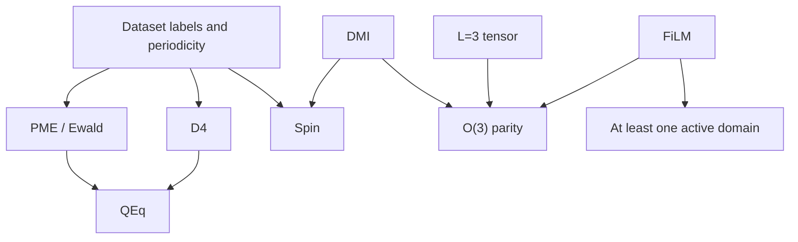
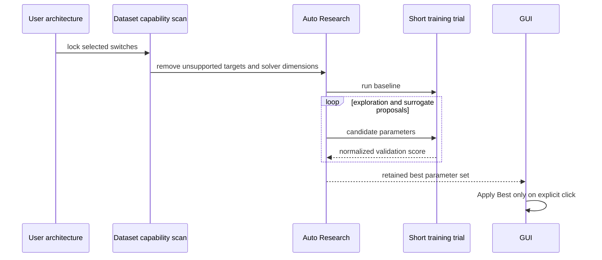

# Training, Auto Research, and Validation

This document expands Sections 4.3-5 of the [paper](PAPER.md). Reported values
are reproducible functional checks of the current source tree. They are not a
claim of a converged universal interatomic potential.

## Training contract

The trainer consumes either one canonical `e3mu-hdf5-v1` file or the retained
legacy static/response extXYZ pair. Canonical HDF5 is preferred because it
preserves target masks, source identity, physical groups, units, and fixed
splits explicitly.

```mermaid
flowchart LR
    D[Canonical data and masks] --> B[Neighbor graphs and batches]
    B --> M[MixedGranularityE3GNN]
    M --> H[Total Hamiltonian]
    H --> O[Predictions and derivatives]
    O --> L[Mask-aware multi-task loss]
    L --> G[Finite-gradient check and clipping]
    G --> U[Optimizer update]
    U --> V[Fixed-split validation]
    V --> C[Safe checkpoint and artifacts]
```



## Mask-aware objective

For target family $`t`$, prediction $`\widehat{\mathbf{y}}_{t,k}`$, reference
$`\mathbf{y}_{t,k}`$, mask or sample weight $`m_{t,k}`$, and component count $`d_t`$,
the implemented multi-task objective is

```math
\mathcal L(\theta)=
\sum_{t\in\mathcal T}w_t
\frac{\sum_k m_{t,k}
\left\|\widehat{\mathbf y}_{t,k}-\mathbf y_{t,k}\right\|_2^2}
{\sum_k m_{t,k}d_t}.
```

Active targets can include energy, forces, dipole, molecular and atomic
polarizability, charges, atomic dipoles, C6, Born effective charge, magnetic
moments, effective spin field, $`J`$, $`D_i`$, and DMI. A target contributes only
when all three conditions hold:

1. its loss weight is positive;
2. the dataset mask is active for at least one item in the batch; and
3. the selected architecture produces the required output.

Energy errors are normalized per atom before aggregation so that large cells
do not dominate solely through atom count. Expensive derivative outputs are
constructed only when their active mask and loss weight require them.

## Training modes

| Mode | Trainable scope | Intended use |
| --- | --- | --- |
| `base` | ground-state Layer-1 branch | establish local energy and force representation |
| `response` | response branch above a base checkpoint | train electric response while retaining a frozen ground model |
| `joint` | active Layer-1, Layer-2, Layer-3, and FiLM parameters | coupled fine-tuning under a shared objective |

The full-chain GUI workflow can freeze the ground branch during response
warmup, assign separate ground and response learning rates, ramp response
weights, and finish with one or more joint stages. The command-line interface
exposes the same `TrainConfig` through JSON presets.

## Architecture and data compatibility

The GUI scans canonical masks and periodicity before enabling switches or loss
fields. The enforced dependency graph is:



The current D4 backend is molecular, so periodic datasets disable D4. PME is
meaningful only for periodic records and requires QEq. Direct $`J`$, $`D_i`$, or
DMI losses remain unavailable for the current portable Neo tiers because their
masks are false.

## Stable optimization safeguards

The trainer refuses to save an unvalidated epoch-0 checkpoint. Each optimizer
step checks model outputs, loss, and every parameter gradient for finite values.
The global gradient norm is evaluated after scale normalization so a float32
sum of squares cannot overflow merely because individual gradients are large.
A failed step reports structure IDs, atom and edge counts, and affected
parameter names before stopping.

QEq and induced-polarization solvers expose both residuals and stability
shifts. A finite solve with a large curvature shift is retained as a diagnostic
rather than presented as a calibrated physical result.

## Validation score and checkpoint selection

Loss weights are optimization choices and must not control model ranking.
Checkpoint selection and Auto Research therefore use

```math
S_{\mathrm{val}}=
\frac{1}{|\mathcal T_{\mathrm{active}}|}
\sum_{t\in\mathcal T_{\mathrm{active}}}
\frac{\mathrm{MAE}_t}{s_t},
```

where $`s_t`$ is a fixed characteristic scale. Current scales are 1 for energy,
force, dipole, polarizability, and magnetic moment; 0.1 for charge, atomic
dipole, atomic polarizability, and BEC; 10 for C6; and 0.01 eV for effective
spin field and Hamiltonian parameters. A candidate cannot appear better by
reducing its own loss coefficient.

## Auto Research

Auto Research first evaluates the current GUI configuration as a baseline. It
then combines random exploration with a small Gaussian-process surrogate. The
same deterministic subset and split are reused across candidates.



Search levels progressively add active loss weights, optimizer/backbone
parameters, staged fine-tuning parameters, and solver parameters that remain
meaningful for the selected architecture. The selected architecture itself is
locked by default. A dataset change invalidates the retained result so values
from an earlier capability scan cannot be applied to a different corpus.

## Live artifacts

With epoch artifacts enabled, training writes under
`<checkpoint parent>/train/<checkpoint stem>/`:

- safe per-epoch checkpoints;
- full and clipped energy/force parity plots;
- force-norm plots;
- loss and MAE histories;
- active auxiliary-task MAEs;
- QEq, polarization, and FiLM residual histories;
- memory histories and machine-readable JSON; and
- the best validated checkpoint at the requested output path.

The PyQt6 GUI displays the latest regression, MAE, solver-residual, and memory
views after every validation epoch.


## Deterministic physical validation

The float64 self-test evaluates complete transformed forward passes and finite
differences. With the documented seed 7, the current maximum errors are:

| Check | Maximum error |
| --- | ---: |
| Rotation: energy | 0 |
| Rotation: force | $`3.47\times10^{-18}`$ |
| Rotation: dipole | $`2.61\times10^{-15}`$ |
| Rotation: polarizability | $`2.22\times10^{-16}`$ |
| Reflection: energy, force, dipole, polarizability | 0 |
| Time reversal: spin energy and effective field | 0 |
| Charge conservation | 0 e |
| QEq stationarity residual | $`9.39\times10^{-12}`$ |
| Conservative-force finite difference | $`8.15\times10^{-12}`$ eV/angstrom |


The current regression suite contains 67 passing tests. It covers O(3)
channels, QEq on Apple MPS, PME and D4 reference behavior, polarization
gradients, spin losses, checkpoint safety, HDF5 masks and splits, dataset-aware
GUI state, and VASP magnetic mapping.

## Short held-out benchmarks

These experiments validate data flow and trainability over small budgets.

| Dataset and held-out split | Training scope | Held-out result |
| --- | --- | --- |
| QM7-X, 8 test molecules | 12 epochs; energy, dipole, polarizability, charge, atomic polarizability | energy 1.907 eV/system; dipole 0.1313 e angstrom/component; polarizability 0.7217 angstrom3/component; charge 0.0949 e/atom; atomic polarizability 0.3089 angstrom3/component |
| BEC, 4 validation cells / 768 atoms | 2 epochs | BEC MAE 0.2156 e/component |
| SCFNN, 4 validation cells / 768 atoms | 20 epochs | dipole MAE 2.435 e angstrom/component; zero baseline 2.972 e angstrom/component |

The QM7-X force and C6 loss weights were zero, so their evaluator outputs are
not trained-accuracy results. The short QEq run required a mean test stability
shift of 14.39 eV, which indicates that its learned raw hardness was not yet
physically calibrated.

## Memory behavior

Force and BEC losses require higher-order autograd graphs. On Apple MPS,
batches are packed by edge count rather than structure count; graph references,
optimizer gradients, plotting figures, and reclaimable allocator blocks are
released after their useful lifetime. Every epoch reports process RSS, active
MPS tensors, driver allocation, and reclaimable cache.

Canonical HDF5 training and checkpoint evaluation stream by default. The
in-memory state contains the structure/atom index, group split, label masks,
and element table. Exact neighbor indices and periodic shift vectors are kept
in a source-, cutoff-, and backend-keyed disk cache. The cache is written once,
then opened read-only as contiguous memory-mapped arrays; it is never rewritten
between epochs. Coordinates and labels are read only when a batch is requested,
and a bounded two-batch CPU thread prefetch overlaps HDF5 assembly with device
execution. `stream_hdf5=False` (or the CLI option
`--no-stream-hdf5`) retains the former whole-corpus materialization path for
debugging. Legacy extXYZ input is still materialized during parsing.

The following isolated-process measurement uses Neo Tiny at a 5 angstrom
cutoff and batch size 8. The selected train/validation corpus contains 4,971
structures, 332,336 atoms, and 13,495,436 directed edges. Incremental RSS is
measured relative to the same imported-runtime baseline in each fresh ARM64
process.

| Data path | Preparation | Data-only epoch | Peak incremental RSS | Total peak RSS |
| --- | ---: | ---: | ---: | ---: |
| Materialized configurations and graphs | 36.55 s | 0.592 s | 918.4 MiB | 1,352.1 MiB |
| Streamed, cold topology cache | 30.44 s | 3.707 s | 372.3 MiB | 807.0 MiB |
| Streamed, reused topology cache | 0.0246 s | 3.733 s | 120.3 MiB | 552.0 MiB |

The reusable exact topology cache is 43.62 MiB. Local atom indices use the
smallest safe unsigned integer width and are restored to `int64` before model
execution. Periodic shifts use a per-structure, bitwise-exact dictionary: the
5,542,544 nonzero Tiny shift rows contain 78,758 unique `float64[3]` bit
patterns, with at most 80 patterns in one structure. The dictionary values and
`uint8` codes occupy about 7.09 MiB; exact local nonzero-row indices use
`uint16`. Compared with the preceding 173.92 MiB sparse cache, the complete
cache is 130.30 MiB smaller. Reconstruction performs only integer lookup and
copying, with no floating-point recomputation.

The file-backed memory-map pages are reclaimable by the operating system; the
reported RSS includes pages touched during the complete digest and epoch scans.
The warm data-only epoch remains about 3.7 seconds, without repeated cache
writes. Materialized and streamed graph digests are identical across all
`AtomicData` labels and weights, atom types, coordinates, edge indices,
metadata, and periodic shifts. Transferring the same measured batch to MPS also
produced identical allocations in both modes: 2.460 MiB active and 40.453 MiB
driver memory. Streaming therefore changes host storage and I/O behavior, not
the graph, numerical precision, cutoff, batch tensor, or accelerator-resident
model calculation. Coordinate and label HDF5 arrays remain streamed, while the
largest repeated topology payload is memory-mapped and batch assembly is
prefetched. For production force training, the remaining data-only overhead is
also overlapped with model forward/backward time.

The machine-readable report and reproducer are
`Validation/StreamingBenchmark/tiny_streaming_comparison.json` and
`Validation/StreamingBenchmark/benchmark_hdf5_memory.py`.

A measured five-epoch MPS run with energy, force, dipole, and polarizability
losses increased RSS by 16.3 MiB between epochs 1 and 5. Post-cleanup active
MPS allocation stayed near 30.8 MiB and driver allocation settled near
116.2 MiB. No sustained-growth warning was triggered.


This short bounded result is evidence against an epoch-to-epoch retained-graph
leak in that workflow. It is not a universal peak-memory bound; peak memory
still depends on edge count, active derivative targets, feature width, and
solver configuration.

## Interpretation limits

- Symmetry and derivative tests establish structural correctness, not
  predictive coverage across all elements.
- The portable corpus has no direct active $`J`$, $`D_i`$, or DMI labels.
- The current D4 implementation does not provide periodic lattice dispersion.
- No converged phonon spectrum or production molecular-dynamics stability
  study is reported.
- Neo's source composition and current BEC rights blocker are described in
  [Datasets](DATASETS.md).

Use [Reproducibility](REPRODUCIBILITY.md) for exact setup and command examples.
